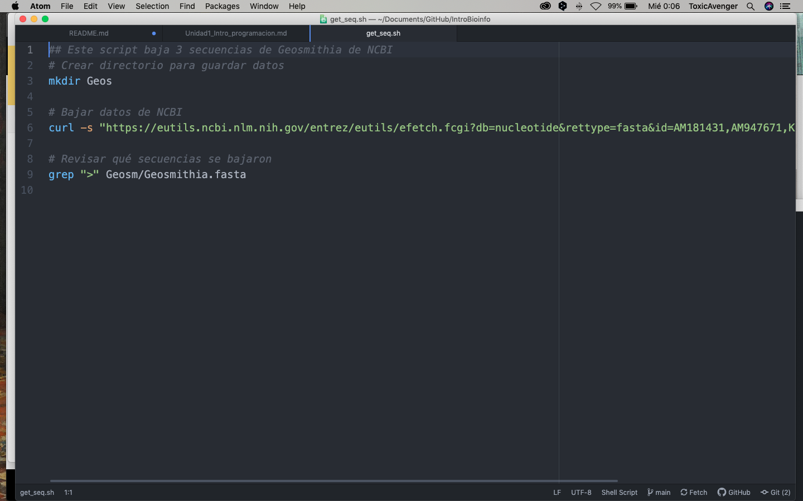
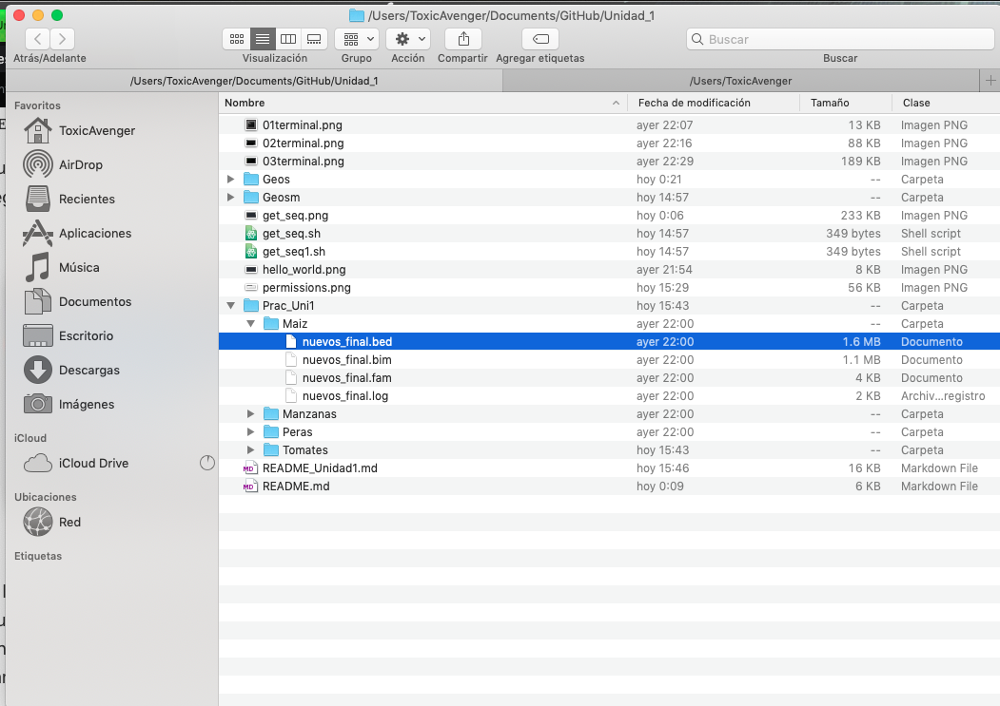

# Unidad 1: Introducción a la programación


## Introducción a la consola y línea de comando de bash y R

Vamos a abrir la terminal. Debe ser un ícono parecido a este. En Ubuntu debe estar por default en tu dock. Si no lo encuentras tanto en Mac como en Ubuntu prueba buscar "Terminal" o "Console".


Tu terminal abierta debe verse parecida a esta:


La primera línea dice la fecha y hora y "ttys001". ttys viene de "Teletype" ([un poco de historia aquí](http://stackoverflow.com/questions/4532413/what-is-tty-on-freebsd)) y significa que el *input* es nuestro teclado, identificado como ttys001.

En mi caso la segunda línea me dice que tengo correo. Uds probablemente no tengan esto.

La tercera línea es la más importante: dice el **nombre del equipo** (Toxic-Avenger en este caso), el **directorio** donde estoy (`~` significa "home directory", lo veremos más adelante) y el **nombre del usuario** con quién estoy en la terminal (en mi caso ToxicAvenger).

Notarás que la tercera línea termina en `$`

`$` significa que la terminal está corriendo con un interpretador Shell o Bash y por un usuario sin mayores privilegios. Si termina en `#` significa que la estás corriendo como **root** que es un "súper usuario" con permisos para desconfigurarlo todo, ten cuidado.


#### ¿Qué significa que La Terminal tenga un interpretador?

Que le damos comandos y nos responde.

El la Terminal no existe el *point and click*. El que funcione como una Línea de Comando significa que tienes que darle comandos de qué hacer línea por línea.

Por ejemplo:

`date` nos responde la fecha actual

`echo algo` nos responde el texto "algo". También lo puedes utilizar con más de una palabra.

`echo hello world`

Algo así debe verse tu terminal:


Pero por practicidad y para facilitar el copiar-pegar en vez de la imágen de la Terminal pondré los comandos (código) y sus resultados, así:

```
Last login: Wed Feb  3 00:33:58 on ttys000
Toxic-Avenger:~ ToxicAvenger$ date
Wed Feb  3 00:35:04 CST 2021
Toxic-Avenger:~ ToxicAvenger$ echo algo
algo
Toxic-Avenger:~ ToxicAvenger$ echo Hello World!
Hello World!
Toxic-Avenger:~ ToxicAvenger$ echo Adios mundo cruel!
Adios mundo cruel!
```

Que es lo mismo que:

```
$ date
Wed Feb  3 00:35:04 CST 2021
$ echo algo
algo
$ echo hello world
hello world
$echo Adios mundo cruel!
Adios mundo cruel!
```

Para facilidad visual, de aquí en adelante utilizaremos la opción con el texto a partir de `$` (al menos que sea pertinente ver lo que hay antes). Este tipo de formato te lo encontrarás en diversos foros de ayuda, libros de textos y manuales.

**Ojo** Se pone `$` solo para **distinguir** que lo que sigue es un comando que debes poner en la Terminal, por lo que **NO** debes copiar los comandos a tu terminal incluyendo el `$`.


**Pregunta**: ¿Qué pasa si intentas correr el comando  `algo`?:

La terminal dirá:

    -bash: algo: command not found

Que quiere decir que no existe el comando `algo`.

De igual forma si corres `$ date` (incluyendo el `$`) te dirá que no existe el comando `$`, aunque `date` sí sea un comando.


La práctica hace al maestro. A continuación veremos algunos de los comandos básicos, pero para practicar más parte de la tarea será resolver los siguientes cursos prácticos:

* Terminar el curso [Learn the Command Line de CodeAcademy](https://www.codecademy.com/learn/learn-the-command-line).

* Adentrarse en el bosque con este [juego de bash](http://web.mit.edu/mprat/Public/web/Terminus/Web/main.html).

### La terminal de R

`R` es un programa que funciona con la línea de comando y por lo tanto puede correrse desde la terminal de varias formas o en su propia terminal.

```{bash}
$ R
R version 3.2.2 (2015-08-14) -- "Fire Safety"
Copyright (C) 2015 The R Foundation for Statistical Computing
Platform: x86_64-apple-darwin13.4.0 (64-bit)

R is free software and comes with ABSOLUTELY NO WARRANTY.
You are welcome to redistribute it under certain conditions.
Type 'license()' or 'licence()' for distribution details.

  Natural language support but running in an English locale

R is a collaborative project with many contributors.
Type 'contributors()' for more information and
'citation()' on how to cite R or R packages in publications.

Type 'demo()' for some demos, 'help()' for on-line help, or
'help.start()' for an HTML browser interface to help.
Type 'q()' to quit R.

> 1+1
[1] 2
> quit()
```

Con `quit()` salgo de la Terminal de R y vuelvo a la Terminal de bash.

R también tiene su propia terminal (lo que sale cuando abres R via su ícono). Sin embargo, nosotros ocuparemos RStudio, que es una interfaz visual que integra la terminal de R con varias funcionalidades útiles e intuitivas.


## Introducción a los Scripts

Un **script** es un archivo de nuestros análisis que es:

* un **archivo de texto plano** (¡¡NO WORD!!)
* permanente,
* repetible,
* anotado,
* compartible

En otras palabras, un script es una recopilación por escrito de las instrucciones que queremos que la computadora corra, de modo que al tener esas instrucciones cualquiera pueda repetir el análisis tal cual se hizo.

El script consta de dos tipos de texto:

**1.** El **código** (comandos) que queremos que se ejecute, en el órden que queremos que lo ejecute.

Es decir lo mismo que escribiríamos en la Terminal para hacer un análisis, pero guardado en un archivo de texto que tiene todos los comandos juntos y que podemos abrir para **repetir** o **compartir** el análisis.

**2.** Comentarios escritos **para un ser humano** en un **lenguaje de humanos**, dígase no solo en español, sino que nos permita entender qué hace el código, qué tipo de información requiere y cualquier otra cosa que una persona cualquiera necesite para poder utilizar el código del script de forma correcta.


Para que la computadora distinga entre el código y los comentarios para humanos se utiliza el símbolo `#`. Todo el texto a la *derecha* del símbolo `#` será ignorado por la computadora, aunque sí "se imprima" en la Consola.

Por ejemplo, el texto siguiente es un extracto de un script para correr QIIME2:

```
#Análisis de secuencias de 16S rRNA QIIME2

#para el entorno de mac funciona cualquiera de los comandos

source activate qiime2
conda activate qiime2


#Es necesario crear un archivo manifest donde se especifique sample-id, absolute-filepath y direction por cada uno de las muestras.

#Crear una carpeta llamada dataset, en donde se encontrarán las secuencias crudas

find dataset/ -name "*fastq.gz" -type f | rename 's/_L001//; s/_001//'

dir="dataset"

ids=$(ls ${dir}/*gz | cut -d\_ -f1,2 | sort | uniq)
echo "sample-id,absolute-filepath,direction" > manifest.csv

for i in ${ids}
do
  name=${i#*/}; name=${name%_*}
  echo "${name},\$PWD/${i}_R1.fastq.gz,forward" >> manifest.csv
  echo "${name},\$PWD/${i}_R2.fastq.gz,reverse" >> manifest.csv
done

#QIIME2 utliza artefactos: * Artifacto = fastq + manifest * Tienen la extensión qza, qiime zip artifact
#Si obtenemos algún error de conda en el entorno qiime2 en AWS.

qiime cutadapt trim-paired \
    --i-demultiplexed-sequences 01_qc/01_demux.qza \
    --p-cores "$(nproc)" \
    --p-front-f ACTCCTACGGGAGGCAGCA \
    --p-front-r GGACTACHVGGGTWTCTAAT  \
    --o-trimmed-sequences 01_qc/01_demux-trim.qza \
    --verbose
```
### Cómo hacer un script

Ya hemos visto que un script es un archivo de texto con código y comentarios. Esta es una generalidad cierta para cualquier lenguaje de programación (aunque los comentarios no son obligatorios se recomienda mucho).

Sin embargo los scripts que corremos desde la Terminal Unix, es decir scripts de *Bash* o *Shell* requiren de 3 pasos para **convertirse en software**:

1. Escribir los comandos a un archivo de texto (escribir el script).
2. Indicarle al sistema operativo (computadora) que programa (lenguaje) debe utilizar para *interpretar* los comandos
3. Darle al *archivo* los *permisos* que necesita para poder ser *ejecutado por Shell*.

### Escribir el script

Escribir un script es escribir en un **editor de texto** los comandos para resolver un problema, de preferencia comentando cada paso.

Una buena forma de escribir un script es:

1. Escribir el algoritmo, es decir los pasos que queremos hacer.
2. Marcar dichos pasos como comentarios (recuerda el uso de `#` para indicar que el texto a su derecha es un comentario, no un comando).
3. Escribir el código para hacer cada paso debajo del comentario correspondiente.

Ejemplo:

* Algoritmo para guardar secuencias de *Geosmithia*

```
Definir secuencias a bajar desde NCBI
Crear directorio para guardar datos
Bajar datos al directorio deseado
Revisar secuencias
Fin
```

* Algoritmo + código para bajar secuencias de *Geosmithia*:


```
## Este script baja 3 secuencias de Geosmithia de NCBI
# Crear directorio para guardar datos
mkdir Geosm

# Bajar datos de NCBI
curl -s "https://eutils.ncbi.nlm.nih.gov/entrez/eutils/efetch.fcgi?db=nucleotide&rettype=fasta&id=AM181431,AM947671,KF808310" > Geosm/Geosmithia.fasta

# Revisar qué secuencias se bajaron
grep ">" Geosm/Geosmithia.fasta
```
*Borralo para siempre* **cuidado**, para siempre en la terminal, es para siempre, aquí no tenemos _papelera de reciclaje_

`rm -rf Geosm`


**Observación**: una ventaja de los scripts es que nos permiten tener en un solo documento *varios* comandos que se utilizaron para hacer algo, es decir, conforme se complican los análisis necesitamos más de una línea de comando para realizarlos.

Si haces los análisis de tu trabajo en la terminal sin tenerlos en un script es como platicar la introducción de tu tesis sin haberla escrito nunca. Considera el correr comandos en la terminal como una **prueba** y ya que todo funcione, pon todos los comandos juntos en **uno más scripts documentados** y deja que corra el análisis de principio a fin solito (veremos adelante cómo).

Para poder realizar un script de manera adecuada y sin artefactos, es necesario correr un Editor de texto plano.

Editores de texto recomendados:

* Mac y Linux (y hasta Windows): [Atom](https://atom.io/)
* Linux: [Gedit](http://sourceforge.net/projects/gedit/)

**NOTA IMPORTANTE**: el workingdirectory de un script siempre es el directorio donde está guardado dicho script. Entonces, es importante que si tu script va a manejar directorios (`cd` a algún lugar) lo planees todo con **rutas relativas** empezando en el directorio donde guardarás el script. ¿Dónde es un buen lugar para guardar el script? Lo veremos con detalle en otra unidad, pero en resumen el mejor lugar es en el mismo directorio que los datos, o en uno muy cercano.

`bash` es un comando que a su vez ejecuta comandos de un stdinput o de un archivo, en este caso nuestro script.

Sin embargo este script **aún no está listo para ser un ejecutable**. La terminación `.sh` podría o podría no existir y a `bash` le daría lo mismo para correr el ejemplo anterior. Para hacer de nuestro script un ejecutable es necesario:

### Indicar con qué programa *interpretar* el script: `#!`

**`#!`** Se lee cómo "Shebang".

Se pone en la **primera línea** de un script seguido del nombre (path) del programa (lenguaje, para bash `/bin/bash`) con el que está escrito el script, para indicarle a la computadora que debe interpretar el script en dicho lenguaje.

Memotecnica: *She bangs* de Ricky Martin.

**Ojo**: el shebang **no** es un comentario aunque empiece con `#`, pues en realidad el símbolo `#!` considera a los caracteres `#` y `!` juntos.


Por ejemplo, para decir que estamos escribiendo un script de Bash que queremos correr en la Terminal la primera línea tendría que decir:

```
#!/bin/bash
```
Ejemplos en otros lenguajes:

```
#!/usr/bin/env python
```

Nuestro script entonces se verá así:



La terminación `.sh` indica que es un archivo Shell (es decir el interpretador de la Terminal, equivalente a decir Bash, recordemos la Unidad 1). Y al darle esta terminación de archivo, o señalar el tipo de lenguaje en el menú de opciones, el editor de texto nos ayuda a leer el código coloreando los comandos, los flags, las variables y los comentarios.

* Hacer el comando ejecutable

`chmod +x get_seq.sh ./get_seq.sh`
`chmod +x get_seq1.sh ./get_seq1.sh`

ls -l nos enlista los archivos (ls) y la bandera (-l) nos da información extendida cada archivo, incluyendo los permisos.

Por ejemplo:
```
Toxic-Avenger:Unidad_1 ToxicAvenger$ ls -l
total 1112
-rw-r--r--@ 1 ToxicAvenger  staff   13162 Feb  2 22:07 01terminal.png
-rw-r--r--@ 1 ToxicAvenger  staff   88485 Feb  2 22:16 02terminal.png
-rw-r--r--@ 1 ToxicAvenger  staff  188590 Feb  2 22:29 03terminal.png
drwxr-xr-x  2 ToxicAvenger  staff      64 Feb  3 00:21 Geos
drwxr-xr-x  3 ToxicAvenger  staff      96 Feb  3 14:57 Geosm
-rw-r--r--@ 1 ToxicAvenger  staff    6421 Feb  3 00:09 README.md
-rw-r--r--@ 1 ToxicAvenger  staff   11282 Feb  3 00:39 README_Unidad1.md
-rw-r--r--@ 1 ToxicAvenger  staff  233089 Feb  3 00:06 get_seq.png
-rwxr-xr-x@ 1 ToxicAvenger  staff     349 Feb  3 14:57 get_seq.sh
-rwxr--r--@ 1 ToxicAvenger  staff     349 Feb  3 14:57 get_seq1.sh
-rw-r--r--@ 1 ToxicAvenger  staff    8096 Feb  2 21:54 hello_world.png
```
ls -l nos enlista los archivos (ls) y la bandera (-l) nos da información extendida cada archivo, incluyendo los permisos.

Veamos cómo leerse (imagen cortesía de [aquí](https://www.samba.org/samba/docs/man/Samba-HOWTO-Collection/AccessControls.html)):


[chmod](https://blog.desdelinux.net/permisos-basicos-en-gnulinux-con-chmod/)es el comando para cambiar estos permisos, lo cual nos permite volver un archivo ejecutable:
```
Toxic-Avenger:Unidad_1 ToxicAvenger$ ls -l
total 1112
-rw-r--r--@ 1 ToxicAvenger  staff   13162 Feb  2 22:07 01terminal.png
-rw-r--r--@ 1 ToxicAvenger  staff   88485 Feb  2 22:16 02terminal.png
-rw-r--r--@ 1 ToxicAvenger  staff  188590 Feb  2 22:29 03terminal.png
drwxr-xr-x  2 ToxicAvenger  staff      64 Feb  3 00:21 Geos
drwxr-xr-x  3 ToxicAvenger  staff      96 Feb  3 14:57 Geosm
-rw-r--r--@ 1 ToxicAvenger  staff    6421 Feb  3 00:09 README.md
-rw-r--r--@ 1 ToxicAvenger  staff   11282 Feb  3 00:39 README_Unidad1.md
-rw-r--r--@ 1 ToxicAvenger  staff  233089 Feb  3 00:06 get_seq.png
-rwxr-xr-x@ 1 ToxicAvenger  staff     349 Feb  3 14:57 get_seq.sh
-rwxr--r--@ 1 ToxicAvenger  staff     349 Feb  3 14:57 get_seq1.sh
-rw-r--r--@ 1 ToxicAvenger  staff    8096 Feb  2 21:54 hello_world.png
```
¿Notas que ahora dice -rwxr? La nueva x quiere decir que ahora el archivo es un ejecutable, para correrlo:
* Ejecutar el comando

`./get_seq1.sh`

ls -l nos enlista los archivos (ls) y la bandera (-l) nos da información extendida cada archivo, incluyendo los permisos.

```
Toxic-Avenger:Unidad_1 ToxicAvenger$ ./get_seq.sh
mkdir: Geosm: File exists
>AM181431.2 Geosmithia sp. CCF3557 18S rRNA gene (partial), 5.8S rRNA gene, 28S rRNA gene (partial), ITS1 and ITS2, strain CCF3557
>AM947671.1 Geosmithia cnesini 18S rRNA gene (partial), ITS1, 5.8S rRNA gene, ITS2 and 28S rRNA gene (partial), strain MK 1820
>KF808310.1 Geosmithia sp. 21 NL-2014 strain MK1665 18S ribosomal RNA gene, partial sequence; internal transcribed spacer 1, 5.8S ribosomal RNA gene, and internal transcribed spacer 2, complete sequence; and 28S ribosomal RNA gene, partial sequence
Toxic-Avenger:Unidad_1 ToxicAvenger$
```
Ojo: hay un `./` antes del nombre del script, esto sirve para decirle dónde está dicho script, ya que por default la Terminal busca los comandos en los directorios enlistados en tu PATH (echo $PATH) para saber cuales son.

Comentario: si tienes una serie de scripts que usas mucho, vale la pena ponerlos todos juntos en una carpeta y volver a esta carpeta parte de tu PATH. Checa el Capítulo 6 de Haddock & Dunn (2011) para cómo.


# Funciones básicas de navegación y manejo de archivos con bash 

Windows, Mac y las interfaces gráficas de Linux (como Ubuntu y Biolinux) tienen un sistema de archivos que estamos acostumbrados a explorar a través carpetas y subcarpetas que podemos ver en una ventana. Por ejemplo así:

 

A continuación vamos a ver cómo navegar por este **mismo** sistema de archivos, pero desde la Terminal y con el teclado en vez de desde una ventana y con clicks.

### `pwd`

`pwd` nos da el directorio en donde estamos (viene de print **working directory**). 

El directorio de trabajo es **dónde estamos**, equivalente a tener una ventana abierta del explorador en una carpeta determinada. Al menos que le indiques lo contrario, todo archivo que se genere como parte de la ejecución de un programa se guardará aquí. También este será el lugar donde cualquier programa/script buscará los archivos que le pidas, y NO los encontrará si no están exactamente ahí. Claro que es posible decirle que busque en otro directorio, lo veremos adelante.  

El working directory de base es la carpeta "home" del usuario de la computadora. En mi caso:
```
Toxic-Avenger:~ ToxicAvenger$ pwd
/Users/ToxicAvenger
```

    $ pwd
    /Users/ticatla
 
La diagonal **/** es el símbolo que separa los directorios en niveles jerárquicos. Es decir `ticatla` es un subdirectorio de `Users` que a su vez es un subdirectorio de `root` (simbolizado aquí como una sola /), la raíz de todos los directorios.

### `cd`

`cd` viene de **change directory** y sirve para movernos a otro directorio. Por ejemplo:

```
Toxic-Avenger:~ ToxicAvenger$ cd Documents/
Toxic-Avenger:Documents ToxicAvenger$ cd POSTDOC_/
Toxic-Avenger:POSTDOC_ ToxicAvenger$  
```

**Pregunta:** ¿Qué pasa con el texto antes del nombre de usuario?

Como se explicó antes, el texto antes de `$` nos indica el nombre del equipo, el directorio actual y el nombre del usuario. El directorio actual cambió de "ToxicAvenger" (home) a "Desktop". 

Ahora vamos a navegar al directorio del repositorio. La navegación se puede hacer de diferentes maneras:


Para esto hay varias opciones:

#### Moverse hacia adelante/abajo (i.e. adentro de subdirectorios):

* **Absolute path** que es dar la ruta (dirección) completa **desde root** hasta el directorio que queremos.

* **Relative path** que es dar la ruta **desde donde estamos** hasta el directorio que queremos.

Ejemplo de ruta absoluta:

```
Toxic-Avenger:~ ToxicAvenger$ cd Documents/GitHub/Unidad_1/Prac_Uni1/
Toxic-Avenger:Prac_Uni1 ToxicAvenger$ cd ~
Toxic-Avenger:~ ToxicAvenger$ 

```
Háganlo en sus compus (terminales). Noten que `ToxicAvenger` es **mi** nombre de usuario, entonces el path absoluto tiene que llevar **su nombre de usuario**.

Ejemplo de ruta relativa:

```
Toxic-Avenger:Prac_Uni1 ToxicAvenger$ 
Toxic-Avenger:Prac_Uni1 ToxicAvenger$ ls
Maiz		Manzanas	Peras		Tomates
Toxic-Avenger:Prac_Uni1 ToxicAvenger$ cd Maiz/
Toxic-Avenger:Maiz ToxicAvenger$ 
``` 

#### Moverse a home:

`~` es una especie de ruta corta a la ruta absoluta de tu directorio home. No importa dónde estés `cd ~` o `cd $HOME` te llevará a home. 

```
Toxic-Avenger:~ ToxicAvenger$ cd Documents/GitHub/Unidad_1/Prac_Uni1/
Toxic-Avenger:Prac_Uni1 ToxicAvenger$ cd ~
Toxic-Avenger:~ ToxicAvenger$ 

Toxic-Avenger:~ ToxicAvenger$ cd Documents/GitHub/Unidad_1/Prac_Uni1/
Toxic-Avenger:Prac_Uni1 ToxicAvenger$ cd $HOME
Toxic-Avenger:~ ToxicAvenger$ 
```

#### Moverse para atrás (hacia el directorio raíz):

Igual puede ser con rutas absolutas o relativas, pero utilizando `..` que representa **parent directory**, es decir el directorio arriba (o atrás, como le entiendas mejor):

`cd ..` por lo tanto te lleva a un directorio arriba de donde estés.

Ejemplo:


```

$ pwd
Toxic-Avenger:Prac_Uni1 ToxicAvenger$ cd Maiz/
Toxic-Avenger:Maiz ToxicAvenger$ cd ..
Toxic-Avenger:Prac_Uni1 ToxicAvenger$ cd ..
Toxic-Avenger:Unidad_1 ToxicAvenger$ cd ..
Toxic-Avenger:GitHub ToxicAvenger$

```

#### Moverse para atrás y para adelante en la misma línea

Puedes usar `..` muchas veces. Ojo con incluir `/` para separar niveles. 

Ejemplo:

```
$pwd
/Users/ToxicAvenger/Desktop/GitHub/Unidad_1/Prac_Uni1/Tomates/VerdesFritos
$ cd ../../Manzanas/
$ pwd
/Users/ToxicAvenger/Desktop/GitHub/Unidad_1/Prac_Uni1/Manzanas

```

Es decir `../` se puede combinar con una ruta relativa. Ejemplo:

```
$ pwd
Toxic-Avenger:~ ToxicAvenger$ cd Documents/GitHub/Unidad_1/Prac_Uni1/Tomates/VerdesFritos/
Toxic-Avenger:VerdesFritos ToxicAvenger$ cd ../../Manzanas/
Toxic-Avenger:Manzanas ToxicAvenger$ pwd
/Users/ToxicAvenger/Documents/GitHub/Unidad_1/Prac_Uni1/Manzanas
Toxic-Avenger:Manzanas ToxicAvenger$  
```

#### No moverse
O en otras palabras ir al directorio donde ya estás. Suena inútil, y en general lo es si lo hace con `cd`, pero el concepto es importante para otros comandos que veremos más adelante. 

`cd ./` te lleva al directorio en el que estás. Lo importante a recordar es que `.` significa "el directorio actual". 


#### Errores comunes al usar `cd`


* `-bash: cd: manzanas: No such file or directory`

 ¿Escribiste bien Manzanas? Ups. No. Es Manzanas no manzanas. Ojo con las mayúsculas. También aguas con  los errores de dedo (e.g. Manzaanas arrojaría el mismo error)

* `-bash: cd: ../Manzanas: No such file or directory`


  Sí está bien escrito, el directorio Manzanas existe y no lo encuentra. Ok, existe, pero NO en el directorio inmediatamente arriba. Checa dónde estás y a dónde dirigen tus `cd ..`

* `-bash: cd..: command not found`. 
  
  Ojo, con tus espacios `cd..` no es lo mismo que `cd ..`. Otro clásico es poner `cd ...`


En resumen: checa que esté bien escrito y que puedas ir a ese directorio con la ruta que le estás pidiendo. 

#### Tips de acceso rápido en la Terminal

**Flecha arriba/abajo** para acceder a los últimos comandos utilizados
**TAB** para "completar" la escritura del path o nombre de archivos.


### `ls`

Enlista los archivos y directorios presentes en un directorio. Ejemplo:

```
$ cd Maiz
$ ls
nuevos_final.bed	nuevos_final.fam
nuevos_final.bim	nuevos_final.log
```

Nota que los enlista en orden alfabético. 

Para tener más info de los archivos:

`ls -l` brinda la misma lista, pero con datos sobre: 
si es un directorio (d) o un archivo (-), permisos (si es sólo lectura, editable, etc y por quién, detalles más adelante), número de links al archivo, qué usuario es el dueño, a qué grupo pertenece dicho usuario, tamaño en bytes, fecha-hora en que se modificó y el nombre del directorio o archivo.

Ejemplo:
```
Toxic-Avenger:Prac_Uni1 ToxicAvenger$ cd Maiz/
Toxic-Avenger:Maiz ToxicAvenger$ ls
nuevos_final.bed	nuevos_final.bim	nuevos_final.fam	nuevos_final.log
Toxic-Avenger:Maiz ToxicAvenger$ ls -l
total 5216
-rw-r--r--  1 ToxicAvenger  staff  1551105 Feb  2 22:00 nuevos_final.bed
-rw-r--r--  1 ToxicAvenger  staff  1109078 Feb  2 22:00 nuevos_final.bim
-rw-r--r--  1 ToxicAvenger  staff     3604 Feb  2 22:00 nuevos_final.fam
-rw-r--r--  1 ToxicAvenger  staff     1825 Feb  2 22:00 nuevos_final.log
```


Pero se pueden ordenar por fecha (y hora, aunque no se vea) de modificación, por ejemplo:

```
Toxic-Avenger:Maiz ToxicAvenger$ ls -lt
total 5216
-rw-r--r--  1 ToxicAvenger  staff     1825 Feb  2 22:00 nuevos_final.log
-rw-r--r--  1 ToxicAvenger  staff     3604 Feb  2 22:00 nuevos_final.fam
-rw-r--r--  1 ToxicAvenger  staff  1109078 Feb  2 22:00 nuevos_final.bim
-rw-r--r--  1 ToxicAvenger  staff  1551105 Feb  2 22:00 nuevos_final.bed
Toxic-Avenger:Maiz ToxicAvenger$ 
``` 


`man ls` abre el manual de `ls` (**o de cualquier otro comando**), donde vienen muchas más opciones para usar este comando.

**Tip**: presiona "q" para salir de la pantalla de `man`. 

**Ejercicio**:
* Enlista el contenido de `Maiz` por tamaño del archivo y has que el tamaño del archivo se lea en KB y MB (ie reducido en vez de todos los bytes).

### `mkdir`

Crea un directorio. 

```
$ mkdir Prueba
$ ls
Prueba			nuevos_final.bim	nuevos_final.log
nuevos_final.bed	nuevos_final.fam
```

Nota: Se puede combinar con paths absolutos o relativos para crearlo en un directorio diferente al WD.


**Ejercicio:** ¿Qué pasa si intentas crear un directorio que ya existe? ¿Para qué sirve el flag `-p`?


### `cp`

Copia un archivo o directorio de lugar A a lugar B.

```
$ cp -r Prueba ../
$ ls ../
Maiz		Manzanas	Peras		Prueba		Tomates
```

¿Por qué utilicé el flag `-r` en el ejemplo anterior?


### `mv`

Mueve un archivo o directorio de lugar A a lugar B. Equivalente a "cut-paste".

```
$ mv ../Prueba ../Manzanas
$ ls ../
Maiz		Manzanas	Peras		Tomates
$ ls ../Manzanas
Prueba

```

Nota que con `mv` no es necesario utilizar `-r` para borrar directorios.


### `rm`

Borra (**AGUAS al usar esto**) archivos o directorios.

```
$ rm -r Prueba
$ rm -r ../Manzanas/Prueba
```

**Pregunta:** ¿Si borras un directorio se borra su contenido? 


### `tar`

Es un método de ultra comprensión (más que zip) utilizado por sistemas Linux/Unix. Viene de "*tape archive*" y originalmente surgió para comprimir archivos para los discos "tape" de respaldo. 

La compresión tar genera archivos "tarball", gzip y bzip. Con terminaciones como `.tar.gz`. Este tipo de compresión es muy utilizada en datos genómicos.

#### Crear un tar.gz

Imaginemos que queremos comprimir la carpeta `Maiz`

```
Toxic-Avenger:Prac_Uni1 ToxicAvenger$ ls
Maiz		Manzanas	Peras		Tomates
Toxic-Avenger:Prac_Uni1 ToxicAvenger$ tar cvzf Maiz.tar.gz Maiz
a Maiz
a Maiz/nuevos_final.log
a Maiz/nuevos_final.bim
a Maiz/nuevos_final.bed
a Maiz/nuevos_final.fam
Toxic-Avenger:Prac_Uni1 ToxicAvenger$ ls
Maiz		Maiz.tar.gz	Manzanas	Peras		Tomates
Toxic-Avenger:Prac_Uni1 ToxicAvenger$ ls -lhS
total 2536
-rw-r--r--  1 ToxicAvenger  staff   1.2M Feb  3 16:26 Maiz.tar.gz
drwxr-xr-x  7 ToxicAvenger  staff   224B Feb  3 15:43 Tomates
drwxr-xr-x  6 ToxicAvenger  staff   192B Feb  2 22:00 Maiz
drwxr-xr-x  3 ToxicAvenger  staff    96B Feb  2 22:00 Manzanas
drwxr-xr-x  3 ToxicAvenger  staff    96B Feb  2 22:00 Peras
Toxic-Avenger:Prac_Uni1 ToxicAvenger$ 
```
¿Qué hacen los flags de `tar` que utilizamos?

`c`  Crea un nuevo archivo .tar.

`v`  Muestra "*Verbosely*" el progreso de la compresión.

`z`  Especifica que queremos un `.gzip`.

`f`  Nombre del archivo tar que queremos como resultado.

#### Descomprimir (Untar) archivos .tar.gz

```
$ rm -r Maiz
$ tar -xvf Maiz.tar.gz
Maiz/
Maiz/.DS_Store
Maiz/nuevos_final.bed
Maiz/nuevos_final.bim
Maiz/nuevos_final.fam
Maiz/nuevos_final.log
$ ls
Maiz		Maiz.tar.gz	Manzanas	Peras		Tomates
```

**Pregunta:** ¿Qué hacen las flags `-xvf`?

#### Ver el contenido de un archivo tar SIN descomprimirlo

```
Toxic-Avenger:Prac_Uni1 ToxicAvenger$ tar -tvf Maiz.tar.gz
drwxr-xr-x  0 ToxicAvenger staff       0 Feb  2 22:00 Maiz/
-rw-r--r--  0 ToxicAvenger staff    1825 Feb  2 22:00 Maiz/nuevos_final.log
-rw-r--r--  0 ToxicAvenger staff 1109078 Feb  2 22:00 Maiz/nuevos_final.bim
-rw-r--r--  0 ToxicAvenger staff 1551105 Feb  2 22:00 Maiz/nuevos_final.bed
-rw-r--r--  0 ToxicAvenger staff    3604 Feb  2 22:00 Maiz/nuevos_final.fam
Toxic-Avenger:Prac_Uni1 ToxicAvenger$ 

```
**Pregunta:** ¿En qué situación puede ser útil ver el contenido de un tar sin descomprimirlo?

[Aquí una guía con más opciones para usar `tar`](http://www.tecmint.com/18-tar-command-examples-in-linux/)

`tar` tiene muchas opciones, lo importante es saber que existen y cómo buscarlas en el manual. Casi siempre:


### Crear archivos desde la terminal

Es posible crear archivos de texto directamente desde la terminal utilizando programas como `vi` y `nano` o el comando `touch`. 


Touch solo crea un archivo sin contenido. Ejemplo :

```
$ cd Maiz
$ touch prueba
$ ls 
nuevos_final.bed	nuevos_final.fam	prueba
nuevos_final.bim	nuevos_final.log
$ rm prueba
```

## curl

`curl` Sirve para bajar archivos de internet a la computadora.

Sintaxis:

    curl [opciones] [direccionURLdelarchivo]
   

Ejemplo, podemos bajar el archivo de texto del README que vive en el repositorio de esta clase:


```
$ curl -s "https://raw.githubusercontent.com/AliciaMstt/BioinfInvRepro/master/README.md"
# Introducción a la bioinformática e investigación reproducible para análisis genéticos

Este es el repositorio de apuntes y código del curso **Introducción a la bioinformática e investigación reproducible para análisis genéticos** [...]
```

O bajar sencuencias de ADN de GeneBank! ([instrucciones de cómo construir la url aquí](http://www.ncbi.nlm.nih.gov/books/NBK25499/#chapter4.EFetch))


```
$ curl -s "https://eutils.ncbi.nlm.nih.gov/entrez/eutils/efetch.fcgi?db=nucleotide&rettype=fasta&id=AB080944.1"
>AB080944.1 Pinus patula chloroplast matK gene for maturase, complete cds
ATGGATGAGTTCCATAGATGCGGAAAGGAAGATAGCTTTTGGCAACAATGCTTTTTATATCCACTCTTTT
TTCAGGAAGATCTTTACGCAATTTCTCATGATCATTATTTGGATGTATCAAGTTCCTCCAGACCGATGGA
ACATTTAAGTTCCAATGATCAATTAAGTTTCCTAACTGTAAAACGTTTGATTGGTCAAATACGTCAACAA
AATCATTCAATTGTTTTATTCGTGAATTGCGATCCAAATCCATTAGCTGATCGCAAGAAGAGTTTCTATT
CTGAATCGGTACTAGAAGCACTTACATTGGTCCTGGAAGTTCCGTTCTCTATATGGTCAAAATATTCTGT
GGAAGGGATGAATGAATCGAAGAGTTTCCGGTCGATCCATTCAATATTTCCCTTCTTAGAGGATAAATTC
CCGCATTCAAATTCTATATTAGATGCACGAATACCCTATTCTATTCATCCGGAAATTTTGGTTCGAACCT
TTCGTCGCTGGATCCGAGATGCTCCCTCCTTGCACCCATTACGATCTGTTCTCTATGAATATAGAAATAG
TCCAGATAATTTACAAAGATCAATTATTGTCGTCCCAAGAGTAAATACGAGATTCTTCCTGTTCCTGTGG
AATTATTATGTCTGTGAATGCGAATCCATTTTATTTTCCCGTCTTAAACGATCCTCTCATTCACGATCGT
TGACTCATGGATCTTTCCCTCAGCGAACTCATTTTCATCGAAAGATAAAACATATTATCATATTTTCTCG
TCGAAATTCACTGAAAAGTATCTGGTCGTTGAAGGATCCTAAAATTCACTATGTTAGATATGGCGAAAGA
CCTATTATAGCTATAAAGGGTGCTCATCTCCTAGTTAAAAAATGTAGATATTATCTTCTAATTTTTCGGC
AATTTTATTTCCATCTTTGGTCCGAACCGTATAGGGTCTGTTCTCATCAATTATCCAAGAATTGTTCTTC
TTCTCCAGGTTATTTTTTGAGGGTTCGGATGAACCCTATTTTGGTCAGAACCAAAATGCTCGATGAGTTA
TTCATCGCCGATCTTATTACCGATGAAATTGATCCAATAGTTCCGATTGTACCAATAATTGGATTATTGG
CTACAGAAAAATTCTGTGACATATCAGGGCGGCCAATTAGTAAATTGTCTTGGACCAGTCTAACAGATGA
TGATATCCTCGATCGATTCGATCAAATTTGGAGAAATCTTTTTCATTACTACAGTGGATCCTTTGATCGA
GATGGTTTATATCGTATAAAGTATATACTTTCATTATCATGTGCTAAAACTTTAGCCTGTAAACATAAAA
GTACGATACGTGTAGTTCGGAAGGAATTAGGTCCAGAACTCTTTAAAAAATCGTTTTCAAAAGAACGAGA
ATTTTATTCTCTGCGCTTTTCATCAAAAGCGGCGGCCCGTTCGCAGAGAGAACGAATTTGGCATTCAGAT
ATTTCCCAGATAAATCCCCTAGCTAATTCCTGGCAAAAGATACAGGATCTGAAAATAGAAAACTTATTTG
ACCAATGAAATGCTCTTTGAGTAATTGCCTCGATTCAGAATCATTTTTATTTTTCTATCCGAGAACTAAA
ATGATTAGGAAATAGATACATTACATGGGGAAAGCCGTGTGCAATGAGAAT
```

En bioinformática `curl` se utiliza para transferir desde archivos FASTA de secuencias individuales de GeneBank hasta genomas completos. 

Nota:
`wget` hace algo parecido a `curl`, pero lo salva a un archivo directamente. No existe de base en Mac, pero es posible instalarlo.

Más info:

* Cómo bajar archivos de GeneBank utilizando e-utils (ejemplo anterior): [http://www.ncbi.nlm.nih.gov/books/NBK25499/#chapter4.EFetch](http://www.ncbi.nlm.nih.gov/books/NBK25499/#chapter4.EFetch)

* Truco para bajar varios metagenomas (o genomas, secuencias, etc) en una sóla línea de código [https://www.biostars.org/p/94875/](https://www.biostars.org/p/94875/)

* Excelente explicación más profunda de `curl` y `wget` en el Capítulo 6 de Buffalo V (2015) Bioinformatics data skills.

### Comodines o el uso de `*` `?` `[]` `{}`

Volvamos a ver el contenido de Maiz:

```
$ cd Maiz
$ ls 
ejemplonano.txt		nuevos_final.bim	nuevos_final.log
nuevos_final.bed	nuevos_final.fam
```

**Ejercicio**: Necesitamos crear más archivos .bed y .fam para los ejemplos de abajo. Queremos qué se llamen `ejemplo_final.bed` y `ejemplo_final.fam`. ¿Cómo hacerlo?


El resultado del ejercicio anterior es:

```
$ ls
ejemplo_final.bed	nuevos_final.bed	nuevos_final.log
ejemplo_final.fam	nuevos_final.bim
ejemplonano.txt		nuevos_final.fam
```

Fácilmente podemos ver que hay 7 archivos, y que hay dos que terminan en .bed y dos que terminan en .fam. 


¿Y si tuviéramos 1,000 archivos con las terminaciones .bed, .fam, bim pero con diferente prefijo? ¿Cómo contarlos y ver cuántos .bed hay?

### `*`

"Comodín" o *wildcard*. Cualquier texto (uno o más caracteres) a partir (derecha o izquierda) de dónde se ponga el `*`.

Ejemplo:

```
$ ls *.bed
ejemplo_final.bed	nuevos_final.bed
$ ls nuevos*
nuevos_final.bed	nuevos_final.fam
nuevos_final.bim	nuevos_final.log

``` 


### `?`
Parecido a ´*´ pero para un sólo carácter.

```
$ ls *.b??
ejemplo_final.bed	nuevos_final.bed	nuevos_final.bim
```

### `[]`

Para agrupar términos de búsqueda. Por ejemplo letras [a-z]

```
$ ls [a-z]*.bed
ejemplo_final.bed	nuevos_final.bed
```

Hay más comodines, puedes explorarlos [aquí](http://tldp.org/LDP/GNU-Linux-Tools-Summary/html/x11655.htm).


 
## Funciones básicas de exploración de archivos con bash

### `more`

Nos permite ver el archivo una línea (flecha abajo) o página a la vez (barra espaciadora). Para salir: `q` 

```
$ more nuevos_final.fam
1 maiz_3 0 0 0 -9
2 maiz_68 0 0 0 -9
3 maiz_91 0 0 0 -9
4 maiz_39 0 0 0 -9
5 maiz_12 0 0 0 -9
6 maiz_41 0 0 0 -9
7 maiz_35 0 0 0 -9
8 maiz_58 0 0 0 -9
9 maiz_51 0 0 0 -9
10 maiz_82 0 0 0 -9
11 maiz_67 0 0 0 -9
12 maiz_93 0 0 0 -9
13 maiz_21 0 0 0 -9
14 maiz_6 0 0 0 -9
15 maiz_101 0 0 0 -9
16 maiz_27 0 0 0 -9
17 maiz_43 0 0 0 -9
18 maiz_1 0 0 0 -9
19 maiz_33 0 0 0 -9
20 maiz_100 0 0 0 -9
21 maiz_24 0 0 0 -9
22 maiz_103 0 0 0 -9
23 maiz_72 0 0 0 -9
24 maiz_10 0 0 0 -9
25 maiz_28 0 0 0 -9
26 maiz_49 0 0 0 -9
27 maiz_56 0 0 0 -9
28 maiz_66 0 0 0 -9
29 maiz_52 0 0 0 -9
nuevos_final.fam 
```

(puedes salir con `q` si no quieres escrolear (yes, esa palabra no existe en español) todo el archivo para abajo)


### `less`
Igual que `more` pero se desarrolló más recientemente y puede abrir archivos binarios y otras cosas raras. Juego de palabras con que *less is more*. Pum pum. Se recomienda usar `less` en la vida.

Dentro de `less` (y `more`) podemos escribir `/` y luego texto, mismo que será buscando dentro del archivo. 

**Ejercicio**: En el archivo que estamos viendo hay unas muestras de teocintles cuyos nombres empiezan con "teos". ¿En qué líneas del documento están?


### `head`

Muestra las primeras líneas de un archivo (default 10).

```
$ head nuevos_final.fam
1 maiz_3 0 0 0 -9
2 maiz_68 0 0 0 -9
3 maiz_91 0 0 0 -9
4 maiz_39 0 0 0 -9
5 maiz_12 0 0 0 -9
6 maiz_41 0 0 0 -9
7 maiz_35 0 0 0 -9
8 maiz_58 0 0 0 -9
9 maiz_51 0 0 0 -9
10 maiz_82 0 0 0 -9
```

### `tail`

Muestra las últimas líneas de un archivo.

**Pregunta:** ¿Para qué podría ser útil ver las últimas líneas de un archivo?

### `wc`
Brinda el número de líneas, el número de palabras y el número de caracteres del archivo.

```
$ wc nuevos_final.fam
     165     990    3604 nuevos_final.fam
```

### `cat`

Viene de *Concatenate*. Sirve para unir uno detrás de otro varios archivos, o para imprimir todo el contendio de un archivo a la consola.


``` 
$ cat nuevos_final.fam *log
1 maiz_3 0 0 0 -9
2 maiz_68 0 0 0 -9
3 maiz_91 0 0 0 -9
4 maiz_39 0 0 0 -9
5 maiz_12 0 0 0 -9
6 maiz_41 0 0 0 -9
7 maiz_35 0 0 0 -9
8 maiz_58 0 0 0 -9
9 maiz_51 0 0 0 -9
10 maiz_82 0 0 0 -9
11 maiz_67 0 0 0 -9
12 maiz_93 0 0 0 -9
13 maiz_21 0 0 0 -9
14 maiz_6 0 0 0 -9
15 maiz_101 0 0 0 -9
16 maiz_27 0 0 0 -9
17 maiz_43 0 0 0 -9
18 maiz_1 0 0 0 -9
19 maiz_33 0 0 0 -9
20 maiz_100 0 0 0 -9
21 maiz_24 0 0 0 -9
22 maiz_103 0 0 0 -9
23 maiz_72 0 0 0 -9
24 maiz_10 0 0 0 -9
25 maiz_28 0 0 0 -9
26 maiz_49 0 0 0 -9
27 maiz_56 0 0 0 -9
28 maiz_66 0 0 0 -9
29 maiz_52 0 0 0 -9
30 maiz_47 0 0 0 -9
31 maiz_80 0 0 0 -9
32 maiz_65 0 0 0 -9
33 maiz_94 0 0 0 -9
34 maiz_36 0 0 0 -9
35 maiz_26 0 0 0 -9
36 maiz_105 0 0 0 -9
37 maiz_30 0 0 0 -9
38 maiz_16 0 0 0 -9
39 maiz_42 0 0 0 -9
40 maiz_4 0 0 0 -9
41 maiz_31 0 0 0 -9
42 maiz_17 0 0 0 -9
43 maiz_46 0 0 0 -9
44 maiz_5 0 0 0 -9
45 maiz_32 0 0 0 -9
46 maiz_19 0 0 0 -9
47 maiz_50 0 0 0 -9
48 maiz_8 0 0 0 -9
49 maiz_34 0 0 0 -9
50 maiz_23 0 0 0 -9
51 maiz_54 0 0 0 -9
52 maiz_14 0 0 0 -9
53 maiz_37 0 0 0 -9
54 maiz_25 0 0 0 -9
55 maiz_55 0 0 0 -9
56 maiz_40 0 0 0 -9
57 maiz_29 0 0 0 -9
58 maiz_60 0 0 0 -9
59 maiz_44 0 0 0 -9
60 maiz_74 0 0 0 -9
61 maiz_89 0 0 0 -9
62 maiz_64 0 0 0 -9
63 maiz_83 0 0 0 -9
64 maiz_75 0 0 0 -9
65 maiz_92 0 0 0 -9
66 maiz_69 0 0 0 -9
67 maiz_84 0 0 0 -9
68 maiz_76 0 0 0 -9
69 maiz_97 0 0 0 -9
70 maiz_70 0 0 0 -9
71 maiz_85 0 0 0 -9
72 maiz_77 0 0 0 -9
73 maiz_71 0 0 0 -9
74 maiz_86 0 0 0 -9
75 maiz_78 0 0 0 -9
76 maiz_102 0 0 0 -9
77 maiz_73 0 0 0 -9
78 maiz_88 0 0 0 -9
79 maiz_79 0 0 0 -9
80 maiz_106 0 0 0 -9
81 maiz_119 0 0 0 -9
82 maiz_148 0 0 0 -9
83 maiz_108 0 0 0 -9
84 maiz_120 0 0 0 -9
85 maiz_151 0 0 0 -9
86 maiz_134 0 0 0 -9
87 maiz_123 0 0 0 -9
88 maiz_153 0 0 0 -9
89 maiz_135 0 0 0 -9
90 maiz_124 0 0 0 -9
91 maiz_184 0 0 0 -9
92 maiz_140 0 0 0 -9
93 maiz_125 0 0 0 -9
94 maiz_141 0 0 0 -9
95 maiz_131 0 0 0 -9
96 maiz_189 0 0 0 -9
97 maiz_57 0 0 0 -9
98 maiz_126 0 0 0 -9
99 maiz_113 0 0 0 -9
100 maiz_138 0 0 0 -9
101 maiz_63 0 0 0 -9
102 maiz_127 0 0 0 -9
103 maiz_114 0 0 0 -9
104 maiz_139 0 0 0 -9
105 maiz_99 0 0 0 -9
106 maiz_129 0 0 0 -9
107 maiz_116 0 0 0 -9
108 maiz_142 0 0 0 -9
109 maiz_110 0 0 0 -9
110 maiz_132 0 0 0 -9
111 maiz_118 0 0 0 -9
112 maiz_144 0 0 0 -9
113 maiz_133 0 0 0 -9
114 maiz_121 0 0 0 -9
115 maiz_111 0 0 0 -9
116 maiz_137 0 0 0 -9
117 maiz_109 0 0 0 -9
118 maiz_146 0 0 0 -9
119 maiz_164 0 0 0 -9
120 maiz_157 0 0 0 -9
121 maiz_171 0 0 0 -9
122 maiz_149 0 0 0 -9
123 maiz_165 0 0 0 -9
124 maiz_159 0 0 0 -9
125 maiz_172 0 0 0 -9
126 maiz_150 0 0 0 -9
127 maiz_166 0 0 0 -9
128 maiz_160 0 0 0 -9
129 maiz_173 0 0 0 -9
130 maiz_152 0 0 0 -9
131 maiz_167 0 0 0 -9
132 maiz_161 0 0 0 -9
133 maiz_174 0 0 0 -9
134 maiz_154 0 0 0 -9
135 maiz_169 0 0 0 -9
136 maiz_162 0 0 0 -9
137 maiz_176 0 0 0 -9
138 maiz_156 0 0 0 -9
139 maiz_170 0 0 0 -9
140 maiz_163 0 0 0 -9
141 maiz_177 0 0 0 -9
142 maiz_178 0 0 0 -9
143 maiz_192 0 0 0 -9
144 maiz_185 0 0 0 -9
145 maiz_201 0 0 0 -9
146 maiz_179 0 0 0 -9
147 maiz_193 0 0 0 -9
148 maiz_186 0 0 0 -9
149 maiz_202 0 0 0 -9
150 maiz_180 0 0 0 -9
151 maiz_195 0 0 0 -9
152 maiz_187 0 0 0 -9
153 maiz_181 0 0 0 -9
155 maiz_197 0 0 0 -9
156 maiz_188 0 0 0 -9
157 maiz_182 0 0 0 -9
158 maiz_198 0 0 0 -9
159 maiz_190 0 0 0 -9
160 maiz_200 0 0 0 -9
161 maiz_183 0 0 0 -9
162 maiz_191 0 0 0 -9
163 teos_96 0 0 0 -9
164 teos_203 0 0 0 -9
163 teos_911 0 0 0 -9
164 teos_9107 0 0 0 -9

@----------------------------------------------------------@
|        PLINK!       |     v1.07      |   10/Aug/2009     |
|----------------------------------------------------------|
|  (C) 2009 Shaun Purcell, GNU General Public License, v2  |
|----------------------------------------------------------|
|  For documentation, citation & bug-report instructions:  |
|        http://pngu.mgh.harvard.edu/purcell/plink/        |
@----------------------------------------------------------@

Web-based version check ( --noweb to skip )
Recent cached web-check found... OK, v1.07 is current

+++ PLINK 1.9 is now available! See above website for details +++ 

Writing this text to log file [ nuevos_final.log ]
Analysis started: Wed May 06 12:19:25 2015

Options in effect:
	--file nuevos_final
	--out nuevos_final
	--recodeA

36931 (of 36931) markers to be included from [ nuevos_final.map ]
Warning, found 165 individuals with ambiguous sex codes
Writing list of these individuals to [ nuevos_final.nosex ]
165 individuals read from [ nuevos_final.ped ] 
0 individuals with nonmissing phenotypes
Assuming a disease phenotype (1=unaff, 2=aff, 0=miss)
Missing phenotype value is also -9
0 cases, 0 controls and 165 missing
0 males, 0 females, and 165 of unspecified sex
Before frequency and genotyping pruning, there are 36931 SNPs
165 founders and 0 non-founders found
Total genotyping rate in remaining individuals is 0.990151
0 SNPs failed missingness test ( GENO > 1 )
0 SNPs failed frequency test ( MAF < 0 )
After frequency and genotyping pruning, there are 36931 SNPs
After filtering, 0 cases, 0 controls and 165 missing
After filtering, 0 males, 0 females, and 165 of unspecified sex
Writing recoded file to [ nuevos_final.raw ] 

Analysis finished: Wed May 06 12:19:30 2015
```

Es decir, básicamente es como copiar-pegar un archivo al final de otro. 


**Ejercicio** ¿Cómo concatenar tres o más archivos a la vez?


**Pregunta:** ¿Y si quisiéramos tener el resultado en un archivo nuevo?

Más detalles y otras formas de redireccionar (que ocupan algunos programas) las puedes encontrar aquí [https://www.tutorialspoint.com/unix/unix-io-redirections.htm](https://www.tutorialspoint.com/unix/unix-io-redirections.htm)

### Regular expressions y búsqueda de patrones (`grep`)

to be continued ...


