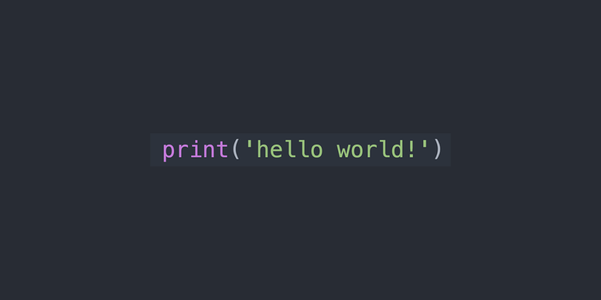
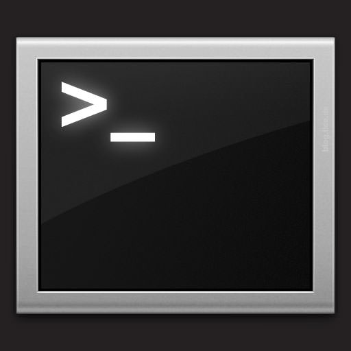
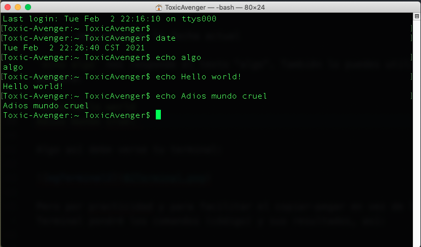

# IntroBioinfo
## Unidad_1
###  Introducción a la consola y línea de comando de bash

`hello word!` 


* Vamos a abrir la terminal. Debe ser un ícono parecido a este:



 En Ubuntu debe estar por default en tu dock. Si no lo encuentras tanto en Mac como en Ubuntu prueba buscar "Terminal" o "Console"

 Una vez abierta deberá verse parecida a esta:

 
 
 La primera línea dice la fecha y hora y "ttys000". ttys viene de "Teletype" ([un poco de historia aquí](http://stackoverflow.com/questions/4532413/what-is-tty-on-freebsd)) y significa que el *input* es nuestro teclado, identificado como ttys000. 

 La segunda línea es la más importante: dice el **nombre del equipo** (Toxic-Avenger en este caso), el **directorio** donde estoy (`~` significa "home directory", lo veremos más adelante) y el **nombre del usuario** con quién estoy en la terminal (en mi caso ToxicAvenger). 

 Notarás que esa línea termina en `$`

 `$` significa que la terminal está corriendo con un interpretador Shell o Bash y por un usuario sin mayores privilegios. Si termina en `#` significa que la estás corriendo como **root** que es un "súper usuario" con permisos para desconfigurarlo todo, ten cuidado.

 #### ¿Qué significa que La Terminal tenga un interpretador? 

 Que le damos comandos y nos responde. 

 El la Terminal no existe el *point and click*. El que funcione como una Línea de Comando significa que tienes que darle comandos (Instrucciones) de qué hacer línea por línea. 

 Por ejemplo:

 `date` nos responde la fecha actual

 `echo algo` nos responde el texto "algo". También lo puedes utilizar con más de una palabra. 

 `echo hello world`
 `Adios mundo cruel`

 Algo así debe verse tu terminal:

  

 Pero por practicidad y para facilitar el copiar-pegar en vez de la imágen de la Terminal pondré los comandos (código) y sus resultados, así:
```
Toxic-Avenger:~ ToxicAvenger$ 
Toxic-Avenger:~ ToxicAvenger$ date
Tue Feb  2 22:26:40 CST 2021
Toxic-Avenger:~ ToxicAvenger$ echo algo
algo
Toxic-Avenger:~ ToxicAvenger$ echo Hello world!
Hello world!
Toxic-Avenger:~ ToxicAvenger$ echo Adios mundo cruel
Adios mundo cruel
Toxic-Avenger:~ ToxicAvenger$ 
```
Para facilidad visual, de aquí en adelante utilizaremos la opción con el texto a partir de `$` (al menos que sea pertinente ver lo que hay antes). Este formato lo encontrarás en la mayoría, si no es que en todos los foros de ayuda, libros, manuales, etc...

**Ojo** Se pone `$` solo para **distinguir** que lo que sigue es un comando que debes poner en la Terminal, por lo que **NO** debes copiar los comandos a tu terminal incluyendo el `$`.
 
**Pregunta obligada**: ¿Qué pasa si intentas correr el comando  `$ algo`?:

La terminal dirá:

    -bash: algo: command not found

Que quiere decir que no existe el comando `algo`. 

De igual forma si corres `$ date` (incluyendo el `$`) te dirá que no existe el comando `$`, aunque `date` sí sea un comando.


 
