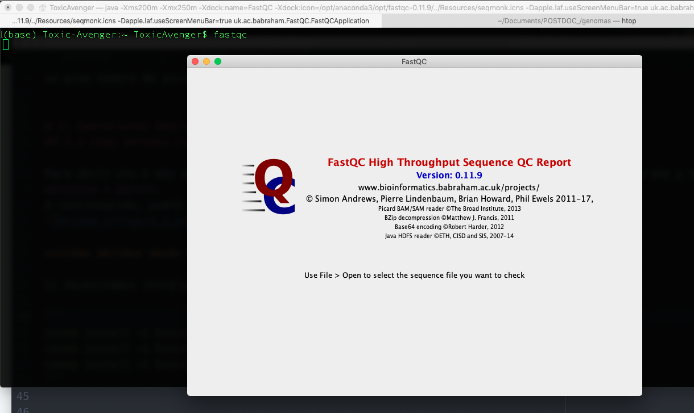
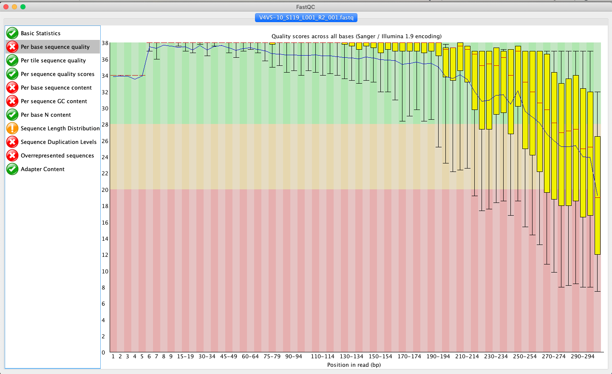

# Unidad_2 : Introducción a la programación

##  Control de calidad de secuencias NGS

Las lecturas crudas obtenidas del secuenciador en Next Generation Sequencing (NGS) pueden contener secuencias de adaptadores usados en la secuenciación, contaminantes y sitios con bajas calidades.
Comúnmente en el extremo 3' de las lecturas posee una menor calidad que el extremo 5'.
El procesamiento de las lecturas para eliminar las secuencias pertenecientes a adaptadores y los pares de bases con baja calidad se denomina Trimming.
Para realizar un trimming adecuado de lecturas se debe hacer un análisis previo de la calidad de la secuenciación mediante el programa FastQC.

### generamos una carpeta en donde estén nuestros genomas o genoma

```
mkdir migenomaX
cd migenomaX
```

##  [FastQC](https://www.bioinformatics.babraham.ac.uk/projects/fastqc/)

FastQC es un programa diseñado para detectar posibles problemas en conjuntos de datos de secuenciación de alto rendimiento. Ejecuta un conjunto de análisis en uno o más archivos de secuencias en bruto en formato fastq o bam y produce un informe que resume los resultados.

Los modernos secuenciadores de alto rendimiento pueden generar decenas de millones de secuencias en una de secuencias en una sola pasada. Antes de analizar esta secuencia para sacar conclusiones biológicas, hay que realizar siempre algunas comprobaciones sencillas de control de calidad para asegurarse de que los datos brutos tienen un buen aspecto y que no hay problemas o sesgos en los datos que puedan afectar a su uso.
utilizarlos.
La mayoría de los secuenciadores generan un informe de control de calidad como parte de su proceso de análisis, pero éste normalmente sólo se centra en identificar los problemas generados por el propio secuenciador.

El **objetivo** de FastQC es proporcionar un informe de control de calidad que pueda detectar los problemas que se originan en el secuenciador o en el material de la biblioteca de la cual partimos
**FastQC** puede ejecutarse de dos maneras: puede ejecutarse como una aplicación interactiva (versión gráfica) independiente para el análisis inmediato de un pequeño número de archivos FastQ, o puede ejecutarse en un modo no interactivo (terminal), en el que puede integrarse en un proceso de análisis más para el procesamiento sistemático de un gran número de archivos.


# 2. Operaciones básicas
## 2.1 Cómo abrimos un archivo

Para abrir uno o más archivos de secuencia de forma interactiva, simplemente ejecute el programa y seleccione *Archivo > Abrir*.
A continuación, podrá seleccionar los archivos que desee analizar.


**¿cómo abrimos desde la terminal?**

1) necesitamos instalar FastQC, Existen varias maneras de instalar:

Mac & linux
```
conda install -c bioconda fastqc
conda install -c bioconda/label/broken fastqc
conda install -c bioconda/label/cf201901 fastqc
```
Mac & linux
```
sudo apt update
sudo apt install fastqc
```

 Si esta bien instalado lo podremos correr así

 `fastqc *_R1.fastq.gz *_R2.fastq.gz`




Los archivos recién abiertos aparecerán inmediatamente en el conjunto de pestañas de la parte superior de la pantalla.
Debido al tamaño de estos archivos, puede tardar un par de minutos en abrirlos. FastQC
funciona con un sistema de colas en el que sólo se abre un archivo a la vez, y los nuevos archivos
nuevos archivos esperan hasta que los archivos existentes hayan sido procesados.
FastQC admite archivos en los siguientes formatos:

* [Fastq](https://pythonhosted.org/OBITools/fastq.html](todas las variantes de codificación de calidad)
* Casava FastQ files*
* Colorspace FastQ
* GZip comprimidos FastQ
* [SAM](https://en.wikipedia.org/wiki/SAM_file_format)
* [BAM](https://support.illumina.com/help/BS_App_RNASeq_Alignment_OLH_1000000006112/Content/Source/Informatics/BAM-Format.htm#)
* SAM/BAM Sólo mapeado (normalmente utilizado para datos de espacio de color)

Por defecto, FastQC intentará adivinar el formato del archivo a partir del nombre del archivo de entrada. Todo lo que
que termine en .sam o .bam se abrirá como un archivo SAM/BAM (utilizando todas las secuencias, mapeadas
y no mapeadas), y todo lo demás será tratado como formato FastQ. Si desea
anular esta detección y especificar el formato de archivo manualmente, puede utilizar el filtro
en el selector de archivos para seleccionar el tipo de archivo que va a cargar. Es necesario
utilizar el selector desplegable para que el programa utilice los modos de archivo BAM mapeado o Casava
ya que estos no se seleccionan automáticamente

## 2.2 Evaluación de resultados

El análisis en FastQC se realiza mediante una serie de módulos de análisis. La parte izquierda
de la pantalla interactiva principal o la parte superior del informe HTML muestran un resumen de los
módulos que se han ejecutado, y una evaluación rápida de si los resultados del módulo
parecen totalmente **normales** (marca verde), **ligeramente anormales** (triángulo naranja) o **muy inusuales** (cruz roja).

Es importante subrayar que, aunque los resultados del análisis parezcan dar un resultado de apto/no apto
estas evaluaciones deben tomarse en el contexto de lo que usted espera de su biblioteca. A
muestra "normal" en lo que respecta a FastQC es aleatoria y diversa.


## 2.3 Guardar el reporte
Además de proporcionar un informe interactivo, FastQC también tiene la opción de crear una
versión HTML de este informe para un registro más permanente. Este informe HTML también puede ser generar directamente ejecutando FastQC en modo no interactivo.
Para crear un informe simplemente seleccione *Archivo > Guardar* informe en el menú principal. Por defecto se creará un informe utilizando el nombre del archivo fastq con _fastqc.zip añadido al final.

El informe se creará para la pestaña del archivo que estaba activa cuando se seleccionó la opción de menú se seleccionó la opción de menú.
El archivo de informe que se crea es en realidad un archivo zip. Al descomprimirlo, se creará una carpeta con el mismo nombre que el archivo del informe. Dentro de ella habrá una serie de archivos, pero el que hay que ver es el archivo **fastqc_report.html** que enlaza con los otros archivos del informe.


# 3.0 Modulos de análisis
##  3.1 estadísticos básicos
El módulo de estadísticas básicas genera algunas estadísticas de composición sencillas para el archivo
analizado.
+ **Nombre del archivo**: El nombre original del archivo analizado
+ **Tipo de archivo**: Indica si el archivo parecía contener llamadas base reales o datos de espacio de color
que han tenido que ser convertidos en llamadas de base
+ **Codificación**: Indica qué codificación ASCII de los valores de calidad se encontró en este archivo.
+ **Total de secuencias**: Un recuento del número total de secuencias procesadas. Hay dos valores reportados, el real y el estimado.
+ **Secuencias filtradas**: Si se ejecuta en modo Casava, las secuencias marcadas como filtradas se eliminarán de todos los análisis. El número de tales secuencias eliminadas se informará aquí. El recuento total de secuencias anterior no incluirá estas secuencias filtradas el número de secuencias realmente utilizadas para el resto del
análisis.
+ **Longitud de la secuencia**: Proporciona la longitud de la secuencia más corta y más larga del
conjunto. Si todas las secuencias tienen la misma longitud, sólo se informa de un valor.
+ **%GC**: El %GC global de todas las bases en todas las secuencias

### **Advertencia**
  La Estadística Básica nunca emite una advertencia.
### **Error**
La Estadística Básica nunca genera un error.

## 3.1 Calidad de la secuencia por base
Esta vista muestra un resumen del rango de valores de calidad en todas las bases en cada
posición en el archivo FastQ.


