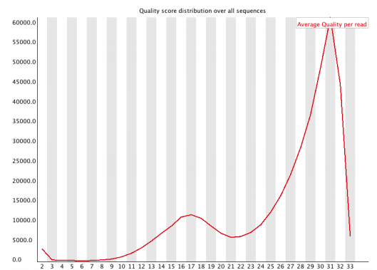
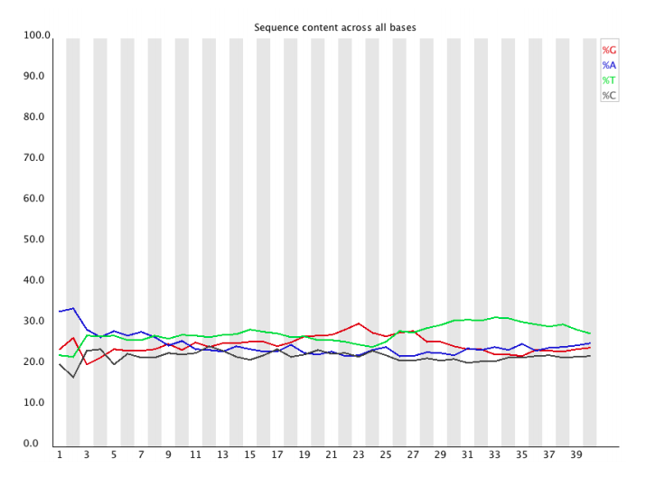
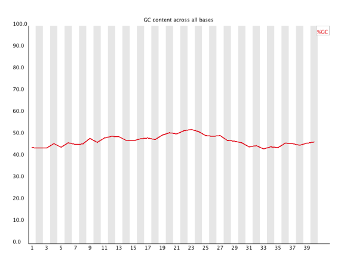
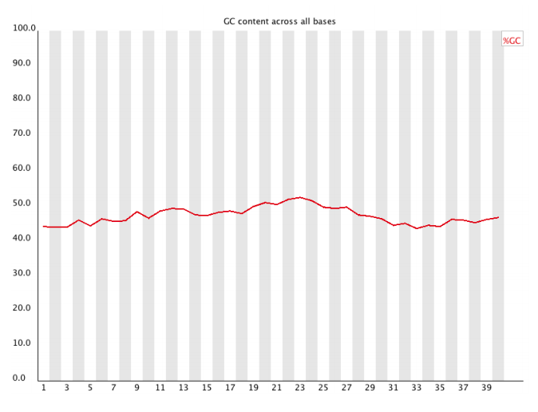
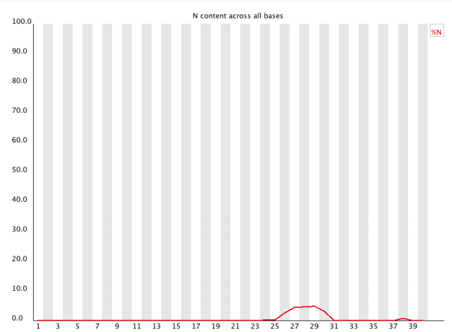
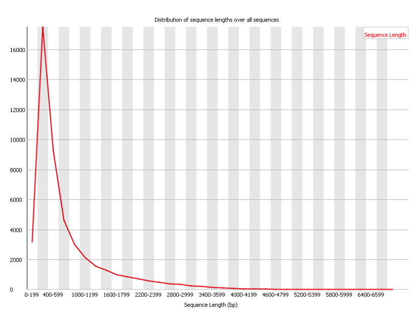
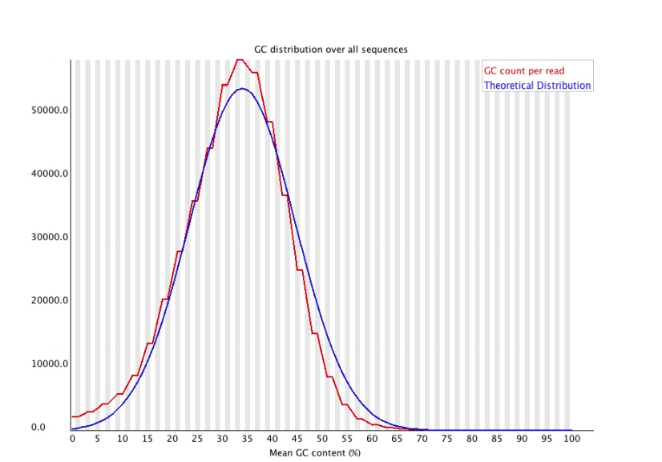
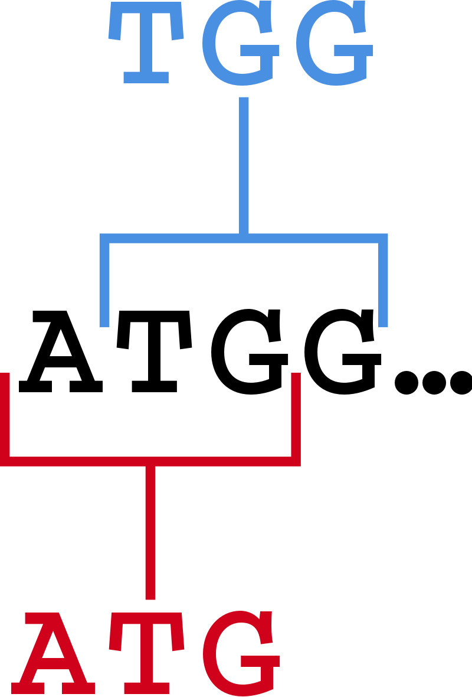
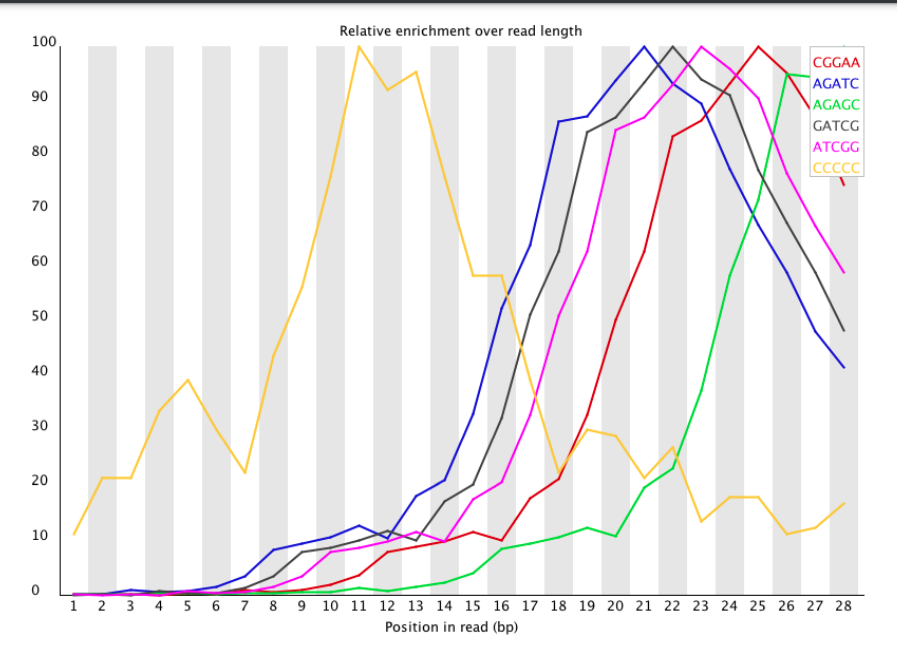

# Unidad_2 : Introducción a la programación

##  Control de calidad de secuencias NGS

Las lecturas crudas obtenidas del secuenciador en Next Generation Sequencing (NGS) pueden contener secuencias de adaptadores usados en la secuenciación, contaminantes y sitios con bajas calidades.
Comúnmente en el extremo 3' de las lecturas posee una menor calidad que el extremo 5'.
El procesamiento de las lecturas para eliminar las secuencias pertenecientes a adaptadores y los pares de bases con baja calidad se denomina Trimming.
Para realizar un trimming adecuado de lecturas se debe hacer un análisis previo de la calidad de la secuenciación mediante el programa FastQC.

### generamos una carpeta en donde estén nuestros genomas o genoma

```
mkdir migenomaX
cd migenomaX
```

##  [FastQC](https://www.bioinformatics.babraham.ac.uk/projects/fastqc/)

FastQC es un programa diseñado para detectar posibles problemas en conjuntos de datos de secuenciación de alto rendimiento. Ejecuta un conjunto de análisis en uno o más archivos de secuencias en bruto en formato fastq o bam y produce un informe que resume los resultados.

Los modernos secuenciadores de alto rendimiento pueden generar decenas de millones de secuencias en una de secuencias en una sola pasada. Antes de analizar esta secuencia para sacar conclusiones biológicas, hay que realizar siempre algunas comprobaciones sencillas de control de calidad para asegurarse de que los datos brutos tienen un buen aspecto y que no hay problemas o sesgos en los datos que puedan afectar a su uso.
utilizarlos.
La mayoría de los secuenciadores generan un informe de control de calidad como parte de su proceso de análisis, pero éste normalmente sólo se centra en identificar los problemas generados por el propio secuenciador.

El **objetivo** de FastQC es proporcionar un informe de control de calidad que pueda detectar los problemas que se originan en el secuenciador o en el material de la biblioteca de la cual partimos
**FastQC** puede ejecutarse de dos maneras: puede ejecutarse como una aplicación interactiva (versión gráfica) independiente para el análisis inmediato de un pequeño número de archivos FastQ, o puede ejecutarse en un modo no interactivo (terminal), en el que puede integrarse en un proceso de análisis más para el procesamiento sistemático de un gran número de archivos.


# 2. Operaciones básicas
## 2.1 Cómo abrimos un archivo

Para abrir uno o más archivos de secuencia de forma interactiva, simplemente ejecute el programa y seleccione *Archivo > Abrir*.
A continuación, podrá seleccionar los archivos que desee analizar.


**¿cómo abrimos desde la terminal?**

1) necesitamos instalar FastQC, Existen varias maneras de instalar:

Mac & linux
```
conda install -c bioconda fastqc
conda install -c bioconda/label/broken fastqc
conda install -c bioconda/label/cf201901 fastqc
```
Mac & linux
```
sudo apt update
sudo apt install fastqc
```

 Si esta bien instalado lo podremos correr así

 `fastqc *_R1.fastq.gz *_R2.fastq.gz`


Los archivos recién abiertos aparecerán inmediatamente en el conjunto de pestañas de la parte superior de la pantalla.
Debido al tamaño de estos archivos, puede tardar un par de minutos en abrirlos. FastQC
funciona con un sistema de colas en el que sólo se abre un archivo a la vez, y los nuevos archivos
nuevos archivos esperan hasta que los archivos existentes hayan sido procesados.
FastQC admite archivos en los siguientes formatos:

* [Fastq](https://pythonhosted.org/OBITools/fastq.html](todas las variantes de codificación de calidad)
* Casava FastQ files*
* Colorspace FastQ
* GZip comprimidos FastQ
* [SAM](https://en.wikipedia.org/wiki/SAM_file_format)
* [BAM](https://support.illumina.com/help/BS_App_RNASeq_Alignment_OLH_1000000006112/Content/Source/Informatics/BAM-Format.htm#)
* SAM/BAM Sólo mapeado (normalmente utilizado para datos de espacio de color)

Por defecto, FastQC intentará adivinar el formato del archivo a partir del nombre del archivo de entrada. Todo lo que
que termine en .sam o .bam se abrirá como un archivo SAM/BAM (utilizando todas las secuencias, mapeadas
y no mapeadas), y todo lo demás será tratado como formato FastQ. Si desea
anular esta detección y especificar el formato de archivo manualmente, puede utilizar el filtro
en el selector de archivos para seleccionar el tipo de archivo que va a cargar. Es necesario
utilizar el selector desplegable para que el programa utilice los modos de archivo BAM mapeado o Casava
ya que estos no se seleccionan automáticamente

## 2.2 Evaluación de resultados

El análisis en FastQC se realiza mediante una serie de módulos de análisis. La parte izquierda
de la pantalla interactiva principal o la parte superior del informe HTML muestran un resumen de los
módulos que se han ejecutado, y una evaluación rápida de si los resultados del módulo
parecen totalmente **normales** (marca verde), **ligeramente anormales** (triángulo naranja) o **muy inusuales** (cruz roja).

Es importante subrayar que, aunque los resultados del análisis parezcan dar un resultado de apto/no apto
estas evaluaciones deben tomarse en el contexto de lo que usted espera de su biblioteca. A
muestra "normal" en lo que respecta a FastQC es aleatoria y diversa.


## 2.3 Guardar el reporte
Además de proporcionar un informe interactivo, FastQC también tiene la opción de crear una
versión HTML de este informe para un registro más permanente. Este informe HTML también puede ser generar directamente ejecutando FastQC en modo no interactivo.
Para crear un informe simplemente seleccione *Archivo > Guardar* informe en el menú principal. Por defecto se creará un informe utilizando el nombre del archivo fastq con _fastqc.zip añadido al final.

El informe se creará para la pestaña del archivo que estaba activa cuando se seleccionó la opción de menú se seleccionó la opción de menú.
El archivo de informe que se crea es en realidad un archivo zip. Al descomprimirlo, se creará una carpeta con el mismo nombre que el archivo del informe. Dentro de ella habrá una serie de archivos, pero el que hay que ver es el archivo **fastqc_report.html** que enlaza con los otros archivos del informe.


# 3.0 Modulos de análisis
##  3.1 estadísticos básicos
El módulo de estadísticas básicas genera algunas estadísticas de composición sencillas para el archivo
analizado.
+ **Nombre del archivo**: El nombre original del archivo analizado
+ **Tipo de archivo**: Indica si el archivo parecía contener llamadas base reales o datos de espacio de color
que han tenido que ser convertidos en llamadas de base
+ **Codificación**: Indica qué codificación ASCII de los valores de calidad se encontró en este archivo.
+ **Total de secuencias**: Un recuento del número total de secuencias procesadas. Hay dos valores reportados, el real y el estimado.
+ **Secuencias filtradas**: Si se ejecuta en modo Casava, las secuencias marcadas como filtradas se eliminarán de todos los análisis. El número de tales secuencias eliminadas se informará aquí. El recuento total de secuencias anterior no incluirá estas secuencias filtradas el número de secuencias realmente utilizadas para el resto del
análisis.
+ **Longitud de la secuencia**: Proporciona la longitud de la secuencia más corta y más larga del
conjunto. Si todas las secuencias tienen la misma longitud, sólo se informa de un valor.
+ **%GC**: El %GC global de todas las bases en todas las secuencias

### **Advertencia**
  La Estadística Básica nunca emite una advertencia.
### **Error**
La Estadística Básica nunca genera un error.

## 3.1 Calidad de la secuencia por base
Esta vista muestra un resumen del rango de valores de calidad en todas las bases en cada
posición en el archivo FastQ.


Para cada posición se dibuja un gráfico de tipo BoxWhisker (boxplots). Los elementos del gráfico son los siguientes
siguientes:
+ La **línea roja central** es el valor de la mediana
+ La **caja amarilla** representa el rango intercuartil (25-75%)
+ Los **bigotes superior e inferior** representan los puntos del 10% y el 90%.
+ La **línea azul** representa la calidad media
+ El **eje Y** del gráfico muestra las puntuaciones de calidad. Cuanto mayor sea la puntuación, mejor será la
mejor es la integración de la base. El fondo del gráfico divide el eje Y en integraciones de muy buena calidad (verde), integraciones de calidad razonable (naranja) y integraciones de mala calidad (rojo).

La calidad de las integraciones en la mayoría de las plataformas se degradará a medida que la ejecución progrese, por lo que es común ver que las llamadas base que caen en la zona naranja hacia el final de la lectura.

### **Advertencia**
Se emitirá una advertencia si el cuartil inferior de cualquier base es inferior a 10, o si la mediana
de cualquier base es inferior a 25.
### **Error**
Este módulo emitirá un fallo si el cuartil inferior de cualquier base es inferior a 5 o si la
mediana de cualquier base es inferior a 20.


## 3.2 Puntuación de calidad por Secuencias

El informe de puntuación de calidad por secuencia le permite ver si un subconjunto de sus secuencias
tienen valores de calidad universalmente bajos. A menudo se da el caso de que un subconjunto de secuencias
de secuencias tengan una calidad universalmente baja, a menudo porque están mal representadas (en el borde del campo de visión, etc.).
campo de visión, etc.), sin embargo, éstas deberían representar sólo un pequeño porcentaje del total de secuencias.
secuencias.


Si una proporción significativa de las secuencias e en una corrida tiene una calidad general baja, esto podría
indicar algún tipo de problema sistemático, posiblemente sólo con una parte de la serie (por ejemplo
un extremo de una célula de flujo).


### **Advertencia**
Se emite una advertencia si la calidad media observada con mayor frecuencia es inferior a 27, lo que equivale a
a una tasa de error del 0,2%.

### **Error**
Se produce un error si la calidad media observada con mayor frecuencia es inferior a 20, lo que equivale a
a una tasa de error del 1%.


## 3.3 Puntuación de calidad por Secuencias

El informe de puntuación de calidad por secuencia le permite ver si un subconjunto de sus secuencias
tienen valores de calidad universalmente bajos. A menudo se da el caso de que un subconjunto de secuencias tengan una calidad universalmente baja, frecuentemente porque están mal representadas (en el borde del campo de visión, etc.), sin embargo, éstas deberían representar sólo un pequeño porcentaje del total de secuencias.
secuencias.



Si una proporción significativa de las secuencias de una corrida tiene una calidad general baja, esto podría
indicar algún tipo de problema sistemático, posiblemente sólo con una parte de la serie.
### **Advertencia**
Se emite una advertencia si la calidad media observada con mayor frecuencia es inferior a 27, lo que equivale a una tasa de error del 0,2%.
### **Error**
Se produce un error si la calidad media observada con mayor frecuencia es inferior a 20, lo que equivale a una tasa de error del 1%.

## 3.4 Contenido de la secuencia por base

Gráficos de contenido de secuencias por base, la proporción de cada posición de base en un archivo para
para la que se ha integrado a cada una de las cuatro bases normales del ADN.




En una biblioteca aleatoria se espera que haya poca o ninguna diferencia entre
las diferentes bases de una secuencia, por lo que las líneas de este gráfico deberían ser paralelas entre sí.
La cantidad relativa de cada base debería reflejar la cantidad total de estas bases
en su genoma, pero en cualquier caso no deberían estar enormemente desequilibradas entre sí.

Si ves fuertes sesgos que cambian en diferentes bases, esto suele indicar una una secuencia sobrerrepresentada que está contaminando su biblioteca. Un sesgo que es consistente en todas las bases indica que la biblioteca original estaba sesgada por la secuencia, o que hubo un problema sistemático durante la secuenciación de la biblioteca.

### **Advertencia**
Este módulo emite una advertencia si la diferencia entre A y T, o G y C es mayor
del 10% en cualquier posición.

### **Error**
Este módulo falla si la diferencia entre A y T, o G y C es superior al 20% en
cualquier posición.

## 3.5 Puntuación de calidad por Secuencias

Este módulo mide el contenido de GC en toda la longitud de cada secuencia de un archivo
y lo compara con una distribución normal modelada del contenido de CG




### **Advertencia**
Este módulo emite una advertencia si el contenido de GC de cualquier base se desvía más del 5% del contenido de GC medio.

### **Error**
Este módulo fallará si el contenido de GC de cualquier base se desvía más del 10% del contenido medio de GC.
GC medio.

## 3.6 Contenido GC por secuencia de cada posición de base en un archivo.

Este módulo mide el contenido de GC en toda la longitud de cada secuencia de un archivo
y lo compara con una distribución normal modelada del contenido de CG



En una biblioteca aleatoria normal se esperaría ver una distribución aproximadamente normal del contenido de GC
donde el pico central corresponde al contenido general de GC del genoma subyacente.
genoma subyacente.
Como no conocemos el contenido de CG del genoma, el contenido modal de GC se calcula a partir de los datos observados y se utiliza para construir una distribución de referencia.

Una distribución de forma inusual podría indicar una biblioteca contaminada o algún otro tipo
de subconjunto sesgado. Una distribución normal que está desplazada indica algún sesgo sistemático
que es independiente de la posición de la base. Si hay un sesgo sistemático que crea una distribución normal desplazada, el módulo no la marcará como un error, ya que no sabe cuál es el GC de su genoma.
sabe cuál debería ser el contenido de GC de su genoma.

### **Advertencia**
Se produce una advertencia si la suma de las desviaciones de la distribución normal representa
más del 15% de las lecturas.

### **Error**

Este módulo indicará un fallo si la suma de las desviaciones de la distribución normal
representa más del 30% de las lecturas.

## 3.7 Contenido de N (bases ambiguas).

Si un secuenciador no puede realizar una integración de base con suficiente confianza, normalmente
sustituirá una integración de base N en lugar de una convencional.
Este módulo muestra el porcentaje de integraciones a bases en cada posición para las que se ha llamado a una N.



No es raro que aparezca una proporción muy baja de Ns en una secuencia, especialmente
especialmente al final de la secuencia. Sin embargo, si esta proporción se eleva por encima de unos pocos porcentajes
sugiere que la línea de análisis no ha podido interpretar los datos lo suficientemente bien como para hacer
llamadas de base válidas.


### **Advertencia**
Este módulo emite una advertencia si alguna posición muestra un contenido de N >5%.

### **Error**
Este módulo genera un error si cualquier posición muestra un contenido de N >20%.

## 3.8 Distribución de la longitud de la secuencia

Algunos secuenciadores de alto rendimiento generan fragmentos de secuencias de longitud uniforme, pero
otros pueden contener lecturas de longitudes muy variables. Incluso dentro de las bibliotecas de longitud uniforme algunos pipelines recortan las secuencias para eliminar las integraciones de base de baja calidad del final.
Este módulo genera un gráfico que muestra la distribución de los tamaños de los fragmentos en el archivo que
fue analizado.



En muchos casos, esto producirá un simple gráfico que muestra un pico en un solo tamaño, pero para
archivos FastQ de longitud variable esto mostrará las cantidades relativas de cada tamaño diferente de
fragmento de la secuencia.


### **Advertencia**
Este módulo emitirá una advertencia si todas las secuencias no tienen la misma longitud.

### **Error**
Este módulo emitirá un error si alguna de las secuencias tiene una longitud cero.

## 3.9 Secuencias duplicadas

En una biblioteca diversa, la mayoría de las secuencias aparecerán sólo una vez en el conjunto final. Un bajo nivel de duplicación puede indicar un nivel muy alto de cobertura de la secuencia objetivo, pero una alta
duplicación es más probable que indique algún tipo de sesgo de enriquecimiento (p. ej., sobreamplificación por PCR).

Este módulo cuenta el grado de duplicación de cada secuencia del conjunto y crea un
gráfico que muestra el número relativo de secuencias con diferentes grados de duplicación.




### **Advertencia**
Este módulo emitirá una advertencia si las secuencias no únicas representan más del 20% del
total.
### **Error**
ste módulo emitirá un error si las secuencias no únicas representan más del 50% del
total


## 3.10 Secuencias sobrerrepresentadas

Una biblioteca normal de alto rendimiento contendrá un conjunto diverso de secuencias, sin que ninguna secuencia individual constituya una pequeña fracción del conjunto. El hecho de que una sola secuencia esté muy sobrerrepresentada en el conjunto significa que es altamente significativa desde el punto de vista biológico, o indica que la biblioteca está contaminada o no es tan diversa como se esperaba.

Este módulo enumera todas las secuencias que representan más del 0,1% del total. Para
conservar la memoria sólo se rastrean las secuencias que aparecen en las primeras 200,000 secuencias
se siguen hasta el final del archivo. Por tanto, es posible que una secuencia que esté sobrerrepresentada pero
que no aparezca al principio del fichero por alguna razón.

Para cada secuencia sobrerrepresentada, el programa buscará coincidencias en una base de datos de
contaminantes comunes e informará del mejor resultado que encuentre. Las coincidencias deben tener al menos 20 pb de longitud y no tener más de 1 desajuste. Encontrar una coincidencia no significa necesariamente que ésta
sea la fuente de la contaminación, pero puede indicarle la dirección correcta.
También sabemos que muchas secuencias de adaptadores son muy similares entre sí, por lo que es posible que se que no sea técnicamente correcta, pero que tenga una secuencia muy similar a la coincidencia real.

Dado que la detección de duplicación requiere una coincidencia de secuencia exacta en toda la longitud de la secuencia, cualquier lectura de más de 75 longitud de la secuencia, cualquier lectura de más de 75 pb se trunca a 50 pb para los fines de este análisis. Aun así, es más probable que las lecturas más largas contengan errores de secuenciación, lo que aumentará artificialmente la diversidad observada y tenderá a subrrepresentar
las secuencias altamente duplicadas.

### **Advertencia**
Este módulo emitirá una advertencia si se encuentra alguna secuencia que represente más del 0,1% del
del total.

### **Error**
Este módulo emitirá un error si se encuentra alguna secuencia que represente más del 1% del
total.


## 3.10 Kmers sobrerrepresentados

¿K-MER? todas las posibles subcadenas de longitud k que contiene una cadena



El análisis de las secuencias sobrerrepresentadas detectará un aumento de las secuencias exactamente duplicadas
pero hay un subconjunto diferente de problemas en los que no funcionará.
Si las secuencias son muy largas y de baja calidad, los errores aleatorios de secuenciación reducirán drásticamente los recuentos de secuencias duplicadas.
Si tiene una secuencia parcial que aparece en varios lugares dentro de su
secuencia, ésta no se verá ni en el gráfico de contenido de bases ni en el análisis de secuencias duplicadas.
duplicado.
Este módulo cuenta el enriquecimiento de cada 5-mer dentro de la biblioteca de secuencias. En
calcula un nivel esperado en el que este k-mer debería haber sido visto basándose en el
contenido de bases de la biblioteca en su conjunto y luego utiliza el recuento real para calcular una
relación observada/esperada para ese k-mer. Además de reportar una lista de aciertos, realizará un
gráfico de los 6 primeros resultados para mostrar el patrón de enriquecimiento de ese Kmer a través de la longitud de sus lecturas. Esto mostrará si tiene un enriquecimiento general, o si hay un patrón de sesgo
en diferentes puntos de la longitud de la lectura.


