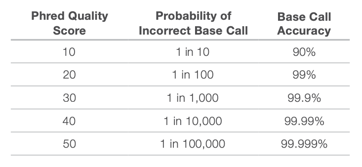
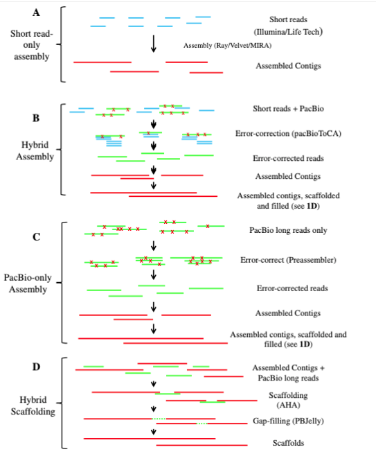

# Unidad_3
## Instalación

### Ubuntu

Estas son las instrucciones para la instalación de los programas necesarios para el análisis que vamos a realizar. Incluye instalación de librerías, programas, y configuración del $PATH. Estas instrucciones fueron probadas en AWS con Ubuntu 20.04 LTS, **van caladas, van garantizadas**

```
sudo apt-get update && sudo apt-get install -y build-essential \
    unzip git cmake rename libltdl-dev libblas-dev liblapack-dev \
    gfortran tree htop zlib1g-dev ncbi-blast+
```

### Modificar el $PATH

```
mkdir -p $HOME/bin
cat <<EOF >> $HOME/.bashrc
##### Microfred #####
if [ -d "\$HOME/bin" ] ; then
export PATH="\$HOME/bin:\$PATH"
fi
EOF    
```

### Recargar y revisar el $PATH

```
source $HOME/.bashrc

echo $PATH
```

## **Conda**

LOS PASOS DE LA SECCIÓN DE CONDA SE HACEN **UNA SOLA VEZ**

## Miniconda
```
cd $HOME/bin
wget https://repo.anaconda.com/miniconda/Miniconda3-latest-Linux-x86_64.sh
bash Miniconda3-latest-Linux-x86_64.sh -b -p $HOME/bin/miniconda3
rm Miniconda3-latest-Linux-x86_64.sh
```

Agregar Miniconda al PATH
```
cat <<EOF >> $HOME/.bashrc
export PATH=\$HOME/bin/miniconda3/bin:\$PATH
EOF
```

Recargar y revisar el $PATH

`source $HOME/.bashrc`
`echo $PATH`

### Agregar canales de Conda

Si tienes una instalación previa de `conda`revisa el archivo `.condarc` para evitar duplicación de canales, generará error cuando quieras instalar programas
¿cómo revisamos?

`nano $HOME/.condarc `

```
cat <<EOF >> $HOME/.condarc
channels:
  - conda-forge
  - bioconda
  - defaults
EOF
```

# [Mamba](https://mamba.readthedocs.io/en/latest/)

`conda install -yc conda-forge mamba`

# ensamble de genomas

### Crearemos un directorio y copiaremos ahí los datos de secuenciación

`mkdir -p $HOME/Ensamble/00_raw && mv misdatos* 00_raw/`

[https://journals.plos.org/plosone/article?id=10.1371/journal.pone.0060204](Identification of Optimum Sequencing Depth Especially for De Novo Genome Assembly of Small Genomes Using Next Generation Sequencing Data. Desai et al. PLOS One 2013)

Existen diferentes bases de datos que podemos utilizar para el análisis de genomas.

Links:

* Americana [SRA:](https://www.ncbi.nlm.nih.gov/sra/ERX008638)
* Europea [ENA:](https://www.ebi.ac.uk/ena/data/view/ERX008638)

# Tres escenarios de datos

Los cambios realizados en estos tres escenarios producen cambios en el nombre de los archivos por lo que se recomienda tener un respaldo de los archivos originales con los nombres originales.
Es recomendable documentar si se renombraron los archivos en un archivo README.txt, README.md en el folder del proyecto.

MiSeq, genera 2 secuencias de salida SR1 y SR2, podemos generar un solo archivo por muestra

```
sampleA_S1_R1_001.fastq.gz
sampleA_S1_R2_001.fastq.gz
```

Este script hace

`find -maxdepth 1 -name "*fastq.gz" -type f | rename 's`


NextSeq, cuatro archivos por muestra, L001-L004

```
sampleA_S1_L001_R1_001.fastq.gz
sampleA_S1_L001_R2_001.fastq.gz

sampleA_S1_L002_R1_001.fastq.gz
sampleA_S1_L002_R2_001.fastq.gz

sampleA_S1_L003_R1_001.fastq.gz
sampleA_S1_L003_R2_001.fastq.gz

sampleA_S1_L004_R1_001.fastq.gz
sampleA_S1_L004_R2_001.fastq.gz
```


Podemos concatenar los archivos uno por uno :(

```
cat sampleA_S1_L00?_R1* > sampleA_S1_L001_R1_001.fastq.gz
cat sampleA_S1_L00?_R2* > sampleA_S1_L001_R2_001.fastq.gz
```

O podemos usar iteraciones para concatenar los archivos de las 4 líneas, L001-L004, de Illumina al formato sampleA_S1_R1.fastq.gz

```
while read i
do
    cat ${i}*R1*.fastq.gz > ${i}_R1.fastq.gz
    cat ${i}*R2*.fastq.gz > ${i}_R2.fastq.gz
done < <(ls *R1*gz | cut -d\_ -f1,2 | sort | uniq )
```
NextSeq, un archivo por muestra, L001

```
sampleA_S1_L001_R1_001.fastq.gz
sampleA_S1_L001_R2_001.fastq.gz
```
___________________________________________________________________________________

# Arrancamos...


### seleccionaremos una submuestra
Una de las limitantes de los ensambles es el hardware con el que se dispone para realizar el análisis. Para fines prácticos utilizaremos sólo el 15% del total de lecturas por muestra. Usaremos seqkit para obtener sub-muestras.

1) Lo mejor es al principio del análisis es saber el número de secuencias crudas (raw) que obtenemos

+ Comparar lecturas antes y después del control de calidad

`mkdir -p $HOME/Ensamble/00_raw && mv *fastq.gz* 00_raw/`

```
cd 00_raw

zcat Q1_CSFP200001976-1a_H57HLDSXY_L1_1.fq.gz | seqkit sample -p 0.15 -o Salbidoflavus_S01_R1.fastq.gz
zcat Q1_CSFP200001976-1a_H57HLDSXY_L1_2.fq.gz | seqkit sample -p 0.15 -o Salbidoflavus_S01_R2.fastq.gz
```
`-p` porcentaje de secuencias por extraer para probar el pipeline
1= 100%
0.15= 15%


`cd $HOME/Ensamble`

* Número de secuencias en el archivo Salbidoflavus_S01_R1.fastq.gz
`zcat 00_raw/Salbidoflavus_S01_R1.fastq.gz  | awk 'END{ print NR/4 }'`

* Cuento cuántas secuencias tengo y de qué longitud en el archivo Salbidoflavus_S01_R1.fastq.gz
`zcat 00_raw/Salbidoflavus_S01_R1.fastq.gz  | \
      awk '{if(NR%4==2) print length($1)}' | sort -n | uniq -c`

* Número de secuencias en el archivo Salbidoflavus_S01_R2.fastq.gz

`zcat 00_raw/Salbidoflavus_S01_R2.fastq.gz | awk 'END{ print NR/4 }'`

* Cuento cuántas secuencias tengo y de qué longitud en el archivo Salbidoflavus_S01_R2.fastq.gz

`zcat 00_raw/Salbidoflavus_S01_R2.fastq.gz | \
      awk '{if(NR%4==2) print length($1)}' | sort -n | uniq -c`

#  7.1 FastQC

El formato FASTQ es una simple extensión del formato FASTA: permite la habilidad de almacenar información alfanumérica de la calidad asociada a cada nucleótido en una secuencia.

Cada archivo fastq tiene cuatro lineas:

* 1.- Nombre de la secuencia (header - id del secuenciador, coordenadas del spot, flow-cell, adaptador, etc.)
* 2.- Secuencia
* 3.- Espaciador (+)
* 4.- Valores de calidad: [Q Score](https://en.wikipedia.org/wiki/FASTQ_format) - alfanumérico.


Puntuación de calidad y precisión en el base calling:




* Dentro del folder $HOME/Ensamble/00_raw/ se encuentran los archivos que utilizaremos para el ensamble.
Creamos una carpeta para el control de calidad de las lecturas

`mkdir -p $HOME/Ensamble/01_qc`

* Utilizamos FastQC para obtener la gráficas de calidad de las lecturas. **ES NECESARIO ACTIVAR EL ENTORNO QC**

```
cd $HOME/Ensamble
source activate qc
fastqc --nogroup -f fastq 00_raw/Salbidoflavus*fastq.gz -o 01_qc
conda deactivate
```
El resultado se encuentra en el archivo **html**


## Recorte de lecturas (Trimeado) para lecturas *paired-end*

En este caso en particular, las secuencias no tienen adaptador ¿o sí? y tienen la misma longitud.

cd $HOME/Ensamble
git clone https://github.com/ATGenomics/adapters.git $HOME/bin/adapters
adapters="$HOME/bin/adapters/NexteraPE-PE.fa"

Activamos el entorno qc

`source activate qc`


`trimmomatic PE -phred33 -threads 16 \
    00_raw/Salbidoflavus_S01_R1.fastq.gz  00_raw/Salbidoflavus_S01_R2.fastq.gz  \
    01_qc/Salbidoflavus_S01_R1.trim.fastq.gz 01_qc/Salbidoflavus_S01_1U.trim.fq.gz \
    01_qc/Salbidoflavus_S01_R2.trim.fastq.gz 01_qc/Salbidoflavus_S01_2U.trim.fq.gz \
    ILLUMINACLIP:${adapters}:2:30:10 SLIDINGWINDOW:4:20 MINLEN:90 CROP:150`

     ILLUMINACLIP:${adapters} eliminamos adaptadores con cierta frecuencia
     SLIDINGWINDOW: 4:20 cuatro nucleoticos en promedio tienen una claidad menor a 20 se elimina la secuencia (incluyendo el par).
     MINLEN: mínimo de largo 130.
     CROP: Cortar la lectura a una longitud determinada

**NOTA** EL orden en que se colocan es importante.

  `conda deactivate`

### Comparar lecturas, antes y después del recorte **trim**:

Cuento cuántas secuencias tengo en el archivo `01_qc/Salbidoflavus_S01_R1.trim.fastq.gz`
`zcat 01_qc/Salbidoflavus_S01_R1.trim.fastq.gz | awk 'END{ print NR/4 }'`

Cuento cuántas secuencias tengo y de qué longitud en el archivo `01_qc/Salbidoflavus_S01_R1.trim.fastq.gz`
`zcat 01_qc/Salbidoflavus_S01_R1.trim.fastq.gz | \
    awk '{if(NR%4==2) print length($1)}' | sort -n | uniq -c`

Cuento cuántas secuencias tengo en el archivo `01_qc/Salbidoflavus_S01_1U.trim.fastq.gz`
`zcat 01_qc/Salbidoflavus_S01_1U.trim.fastq.gz | awk 'END{ print NR/4 }'`


### Los mismo pero para R2:
Cuento cuántas secuencias tengo en el archivo `01_qc/Salbidoflavus_S01_R2.trim.fastq.gz`
`zcat 01_qc/Salbidoflavus_S01_R2.trim.fastq.gz | awk 'END{ print NR/4 }'`

Cuento cuántas secuencias tengo y de qué longitud en el archivo `01_qc/Salbidoflavus_S01_R2.trim.fastq.gz`
`zcat 01_qc/Salbidoflavus_S01_R2.trim.fastq.gz | \
    awk '{if(NR%4==2) print length($1)}' | sort -n | uniq -c`

Cuento cuántas secuencias tengo en el archivo `01_qc/Salbidoflavus_S01_2U.trim.fq.gz`
`zcat 01_qc/Salbidoflavus_S01_2U.trim.fq.gz | awk 'END{ print NR/4 }'`


# Evaluación de la preparación de la libreria con PhiX (control interno)

[PhiX](https://support.illumina.com/bulletins/2017/02/what-is-the-phix-control-v3-library-and-what-is-its-function-in-.html)

En una corrida estandar se introduce el 1% de PhiX, según el manual y en bacterias con baja complejidad,
se recomienda utilizar el 10%, sin embargo en bacterias que contienen un mayor/menor valor de GC, se
recomienda aumentar el % de secuencias de PhiX. Lo mejor es utilizar todo el "genoma de PhiX".

Crear index de la referencia:
[BWA](https://github.com/lh3/bwa#type): es un paquete de software para el mapeo de secuencias de ADN contra un gran genoma de referencia, como el genoma humano.
A mayor número de lecturas de Phix, mayor probabilidad de tener un Prfago en el genoma problema.
Evidentemente me quedaría con las secuencias que no mapearon vs PhiX.

```
cd $HOME/Ensamble
source activate qc
tar -zxvf PhiX_Illumina_RTA.tar.gz && rm PhiX_Illumina_RTA.tar.gz
bwa index PhiX/Illumina/RTA/Sequence/Chromosomes/phix.fa -p 01_qc/phix
conda deactivate
```

Mapear="Alineamiento" *lecturas* versus la referencia:


`cd $HOME/Ensamble
source activate qc`

1) 3 scritp usando | Indexar y alinear vs esa referencia
2) Selecciona las secuencias que no mapean vs PhiX
3) Sort-ordenar esas secuencias no mapeadas

```
cd $HOME/Ensamble

source activate qc
bwa mem -t 8 01_qc/phix \
    01_qc/Salbidoflavus_S01_R1.trim.fastq.gz \
    01_qc/Salbidoflavus_S01_R2.trim.fastq.gz | \
    samtools view -bS -f4 - | \
    samtools sort -@ 4 - -o 01_qc/Salbidoflavus.phix.sorted.bam

samtools fastq \
    -1 01_qc/Salbidoflavus_S01_R1.trim.clean.fastq.gz \
    -2 01_qc/Salbidoflavus_S01_R2.trim.clean.fastq.gz \
    -s 01_qc/Salbidoflavus_S01_S.trim.clean.fastq.gz \
    01_qc/Salbidoflavus.phix.sorted.bam

```

### Contar, DE NUEVO.
.clean son archivos de salidos después de mapear vs PHIX
```
ls -ltrh 01_qc/
zcat 01_qc/Salbidoflavus_S01_R1.trim.clean.fastq.gz | awk 'END{ print NR/4 }'
zcat 01_qc/Salbidoflavus_S01_R2.trim.clean.fastq.gz | awk 'END{ print NR/4 }'
```
**Nota** Cuando no hay secuencias de PHIX, podemos trabajar con los archivos *.trim.*


# Ensamble de novo


Estrategias de ensamble:





Powers, J.G., Weigman, V.J., Shu, J. et al. Efficient and accurate whole genome assembly and methylome profiling of E. coli. BMC Genomics 14, 675 (2013). https://doi.org/10.1186/1471-2164-14-675


Activamos el ambiente

 `assembly
 cd $HOME/Ensamble
 mkdir -p 01_qc/kmerfinder
`

#### Identificación de taxonómica de especies

##### KmerFinder https://cge.cbs.dtu.dk/services/KmerFinder/
## **Sin miedo a la terminal**


cd $HOME/Ensamble
mkdir -p 01_qc/kmerfinder

 kmerfinder.py -i 01_qc/Salbidoflavus_S01_R1.trim.clean.fastq.gz -o 01_qc/kmerfinder \
     -db /opt/KmerFinder_DB/bacteria/bacteria.ATG.name \
     -tax /opt/KmerFinder_DB/bacteria/bacteria.tax -x -q

less -S 01_qc/kmerfinder/results.txt

No. Acceso
Score- valor alto
Expected 100
Template_length
Query_coverage


## Estimación de K-mer

Según la Wikipedia:
In bioinformatics, k-mers are substrings of length k contained within a biological sequence.
  De acuerdo a esto, la secuencia ATGG tiene dos 3-mer: TGG y ATG.

  ejemplo de kmer

  Murciélago
  Mur
   urc
    rci
     cié                8 3Kmer
      iél
       éla
        lag
         ago
  Murciélago

Imagen de gráfica de la muestra


# Usaremos Kmergenie para obtener la distribución de K-mers de nuestro genomas.

  cd $HOME/Ensamble

  cat 01_qc/Salbidoflavus_S01_R1.trim.clean.fastq.gz 01_qc/Salbidoflavus_S01_R2.trim.clean.fastq.gz > Salbidoflavus.fq.gz

  source activate kmergenie

  kmergenie Salbidoflavus.fq.gz

### Ponemos la salida de Kmergenie en 01_qc
mv histograms.dat 01_qc/
mv histograms_report.html 01_qc/

Abrimos el html


Obtenemos la longitud de K-mer que presenta una mayor distribución
### K-mer length
tail -n+2 01_qc/histograms.dat | sort -nrk2 | awk 'NR==1 {print $1}'

El mejor número de K-mer obtenido con Kmergenie es: 47

eliminamos los archivos temporales

rm -f *histo *pdf Salbidoflavus.fq.gz


# EnsAmble


Ensamblador que utiliza grafos de Bruijn

cd $HOME/Ensamble

velveth 02_assembly/denovo_velvet/ec_47 47 -fastq -separate \
    -shortPaired 01_qc/Salbidoflavus_S01_R1.trim.clean.fastq.gz 01_qc/Salbidoflavus_S01_R2.trim.clean.fastq.gz


    cd $HOME/Ensamble

    velvetg 02_assembly/denovo_velvet/ec_47 -read_trkg yes -ins_length auto \
              -cov_cutoff auto -exp_cov auto

Las últimas lineas de la salida estándar de Velvet nos darán los parámetros para mejorar el ensamble:
Estimated Coverage = 51.663610
Estimated Coverage cutoff = 25.831805
Final graph has 296 nodes and n50 of 1614804581, max 1867599102, total 4313423170, using 6825503/6850400 reads


Contamos el número de caracteres > que aparecen en el archivo. En un archivo FASTA se espera que haya una cabacera (>) por cada secuencia.
grep -c \> 02_assembly/denovo_velvet/ec_47/contigs.fa

### Calculamos el tamaño del inserto y la cobertura esperada:

velvet_contrib="$HOME/bin/velvet_1.2.10/contrib"

perl ${velvet_contrib}/estimate-exp_cov/velvet-estimate-exp_cov.pl 02_assembly/denovo_velvet/ec_47/stats.txt
Resultado: promedio 56

perl ${velvet_contrib}/observed-insert-length.pl/observed-insert-length.pl 02_assembly/denovo_velvet/ec_47
Resultado


Al parecer Velvet hizo un buen trabajo, ¿es así?

velvetg 02_assembly/denovo_velvet/ec_47 -read_trkg yes -ins_length 350 -cov_cutoff 30 -exp_cov 51
Resultado Final graph has 329 nodes and n50 of 173136, max 459997, total 6910087, using 6808787/6850400 reads

grep -c \> 02_assembly/denovo_velvet/ec_47/contigs.fa
 Resultado 160

Valor arbitrario por default-

 velvetg 02_assembly/denovo_velvet/ec_47 -read_trkg yes -ins_length 200 \
          -cov_cutoff 40 -exp_cov 80 -min_contig_lgth 300

          grep -c \> 02_assembly/denovo_velvet/ec_47/contigs.fa

-min_contig_lgth 300 **145 contigs**
-min_contig_lgth 300 **109 contigs**
-min_contig_lgth 500 **105 contigs**
-min_contig_lgth 1000 **100 contigs**


tablet afg

velvetg 02_assembly/denovo_velvet/ec_47 -read_trkg yes -ins_length 300 \
          -cov_cutoff 40 -exp_cov 80 -min_contig_lgth 300 -amos_file yes

-min_contig_lgth 300 ¿qué tanto elimina con este modificación          

https://ics.hutton.ac.uk/tablet/download-tablet/


# 8.3.2 SPAdes

Ejecutamos SPades con determinación automática de K-mer:

cd $HOME/Ensamble

source activate assembly

spades.py -1 01_qc/Salbidoflavus_S01_R1.trim.clean.fastq.gz \
          -2 01_qc/Salbidoflavus_S01_R2.trim.clean.fastq.gz \
          -o 02_assembly/denovo_spades/Salbidoflavus -t 16 -m 32

-t número de núcleos
-m  memoria ram disponible

conda deactivate


 O especificamos el **k-mer**:

 source activate assembly

spades.py -1 01_qc/Salbidoflavus_S01_R1.trim.clean.fastq.gz \
          -2 01_qc/Salbidoflavus_S01_R2.trim.clean.fastq.gz \
          -o 02_assembly/denovo_spades/ecoli -t 8 -m 32 -k 47

spades.py -1 01_qc/ecoli_S01_R1.trim.fastq.gz \
          -2 01_qc/ecoli_S01_R2.trim.fastq.gz \
          -o 02_assembly/denovo_spades/ecoli -t 8 -m 32 -k 31,47

conda deactivate

# 8.4 Estadísticas de ensamble

Colocar cada contig en una sola línea y contar líneas y la distribución de su longitud.
 **velvet**

one_liner 02_assembly/denovo_velvet/ec_47/contigs.fa

grep -v \> 02_assembly/denovo_velvet/ec_47/contigs.fa | awk '{ print length }' | sort -nr | uniq

**spades**
one_liner 02_assembly/denovo_spades/Salbidoflavus/scaffolds.fasta
grep -v \> 02_assembly/denovo_spades/Salbidoflavus/scaffolds.fasta | awk '{ print length }' | sort -nr | uniq

### Un vistazo general a los archivos de ensamble:

source activate qc

assembly-stats 02_assembly/denovo_spades/Salbidoflavus/scaffolds.fasta
assembly-stats 02_assembly/denovo_velvet/ec_47/contigs.fa

conda deactivate


# 8.5 Amplitud y profundidad de cobertura

mkdir -p 03_assembly_qc

[bwa](http://bio-bwa.sourceforge.net/bwa.shtml)

##########################V E L V E T ######################################

bwa index -p 03_assembly_qc/velvet_assembly 02_assembly/denovo_velvet/ec_47/contigs.fa

bwa mem -t 4 03_assembly_qc/velvet_assembly \
    01_qc/Salbidoflavus_S01_R1.trim.clean.fastq.gz  01_qc/Salbidoflavus_S01_R1.trim.clean.fastq.gz  | \
    samtools view -Sb - | samtools sort - -o 03_assembly_qc/velvet_assembly.sorted.bam


[samtools](http://www.htslib.org/doc/samtools.html)

conda deactivate

##SAM/BAM

SAM son las siglas para Sequence Alignment Map, un formato de texto delimitado por tabuladores; consiste de un header, el cual es opcional, y una sección de alineamiento. En caso de estar presente el header empiezan con el símbolo @. Cada alineamiento tiene 11 campos obligatorios para información esencial del alineamiento, como posición de mapeo y otros campos que hacen que formato SAM flexible y específico.


Alineamiento:
image


cd $HOME/Ensamble

source activate qc

samtools view -b -f 4 \
    03_assembly_qc/velvet_assembly.sorted.bam \
    > 03_assembly_qc/velvet_assembly.unmapped.sorted.bam

samtools view -b -F 4 \
    03_assembly_qc/velvet_assembly.sorted.bam \
    > 03_assembly_qc/velvet_assembly.mapped.sorted.bam

Para comparar con los de referencia es necesario indexar los archivos mapeados y no mapeados

samtools index 03_assembly_qc/velvet_assembly.sorted.bam
samtools index 03_assembly_qc/velvet_assembly.mapped.sorted.bam
samtools index 03_assembly_qc/velvet_assembly.unmapped.sorted.bam


source activate qc
samtools depth 03_assembly_qc/velvet_assembly.mapped.sorted.bam \
            > 03_assembly_qc/velvet_assembly_depth.txt

conda deactivate

Contando el total de bases mapeadas (assembly_stats)

# Bases mapped and sum depth: 4472581 596551566
awk '{ c++; s+=$3 } END {print c " " s}' 03_assembly_qc/velvet_assembly_depth.txt

# Sum depth: 133.38
awk '{ c++; s+=$3 } END { print s/c }' 03_assembly_qc/velvet_assembly_depth.txt


# Breadth of coverage (with >= 5X coverage depth): 99.98
awk '{c++; if($3>5) total+=1}END{print (total/c)*100}' 03_assembly_qc/velvet_assembly_depth.txt


cubierto el 99.973 mapean contra mi ensamble, estoy usando practicamente todas mis secuencias.

de bam > fastq

 de estos que mapearon entre mis lecturas y los contigs ¿cuantos corresponden al R1, R2, single (s)?

 cd $HOME/Ensamble
 source activate qc

 samtools fastq -c 9 \
         -1 03_assembly_qc/Salbidoflavus_velvet_R1.fastq.gz \
         -2 03_assembly_qc/Salbidoflavus_velvet_R2.fastq.gz \
         -s 03_assembly_qc/Salbidoflavus_velvet_S.fastq.gz \
         03_assembly_qc/velvet_assembly.mapped.sorted.bam

results:
discarded 3182 singletons
processed 6790528 reads


zcat 03_assembly_qc/ecoli_velvet_R1.fastq.gz | awk 'END{ print NR/4 }'
zcat 03_assembly_qc/ecoli_velvet_R2.fastq.gz | awk 'END{ print NR/4 }'
zcat 03_assembly_qc/ecoli_velvet_S.fastq.gz | awk 'END{ print NR/4 }'

  #################################### S P A D E S ############################################

bwa index -p 03_assembly_qc/spades_assembly 02_assembly/denovo_spades/Salbidoflavus/scaffolds.fasta

bwa mem -t 4 03_assembly_qc/spades_assembly \
    01_qc/Salbidoflavus_S01_R1.trim.clean.fastq.gz  01_qc/Salbidoflavus_S01_R2.trim.clean.fastq.gz  | \
    samtools view -Sb - | samtools sort - -o 03_assembly_qc/spades_assembly.sorted.bam


    samtools view -b -f 4 \
        03_assembly_qc/spades_assembly.sorted.bam \
        > 03_assembly_qc/spades_assembly.unmapped.sorted.bam

    samtools view -b -F 4 \
        03_assembly_qc/spades_assembly.sorted.bam \
        > 03_assembly_qc/spades_assembly.mapped.sorted.bam

    Para comparar con los de referencia es necesario indexar los archivos mapeados y no mapeados

    samtools index 03_assembly_qc/spades_assembly.sorted.bam
    samtools index 03_assembly_qc/spades_assembly.mapped.sorted.bam
    samtools index 03_assembly_qc/spades_assembly.unmapped.sorted.bam

    conda deactivate

    source activate qc
    samtools depth 03_assembly_qc/spades_assembly.mapped.sorted.bam \
                > 03_assembly_qc/spades_assembly_depth.txt


    Contando el total de bases mapeadas (assembly_stats)

    # Bases mapped and sum depth: 6946155 684881193

awk '{ c++; s+=$3 } END {print c " " s}' 03_assembly_qc/spades_assembly_depth.txt

  # Sum depth: 98.5986

awk '{ c++; s+=$3 } END { print s/c }' 03_assembly_qc/spades_assembly_depth.txt


  # Breadth of coverage (with >= 5X coverage depth): 99.951
awk '{c++; if($3>5) total+=1}END{print (total/c)*100}' 03_assembly_qc/spades_assembly_depth.txt

samtools fastq -c 9 \
        -1 03_assembly_qc/Salbidoflavus_spades_R1.fastq.gz \
        -2 03_assembly_qc/Salbidoflavus_spades_R2.fastq.gz \
        -s 03_assembly_qc/Salbidoflavus_spades_S.fastq.gz \
        03_assembly_qc/spades_assembly.mapped.sorted.bam


zcat 03_assembly_qc/spades_spades_R1.fastq.gz | awk 'END{ print NR/4 }'
zcat 03_assembly_qc/spades_spades_R2.fastq.gz | awk 'END{ print NR/4 }'
zcat 03_assembly_qc/spades_spades_S.fastq.gz | awk 'END{ print NR/4 }'

discarded 3856 singletons
processed 6850240 reads


# Ensamble con **R e f e r e n c i a**

a) mapear dircatamente los realizados
b) Utilizar la referencia como una guía para mi EnsAmble

wget -P 04_assembly_ref/ https://ftp.ncbi.nlm.nih.gov/genomes/refseq/bacteria/Streptomyces_albidoflavus/latest_assembly_versions/GCF_000156475.1_ASM15647v1/GCF_000005845.2_ASM584v2_genomic.fna.gz


Mapeamos las lecturas de 01_qc versus el genoma de referencia.

cd $HOME/Ensamble

source activate qc

bwa index -p 04_assembly_ref/Salbi \
     04_assembly_ref/GCF_000156475.1_ASM15647v1_genomic.fna.gz

bwa mem -t 4 04_assembly_ref/Salbi \
   01_qc/Salbidoflavus_S01_R1.trim.clean.fastq.gz 01_qc/Salbidoflavus_S01_R2.trim.clean.fastq.gz | \
   samtools view -Sb - | samtools sort - -o 04_assembly_ref/Salbi_vs_reads.sorted.bam

samtools index 04_assembly_ref/Salbi_vs_reads.sorted.bam

conda deactivate


### Se filtra las lecturas en mapeadas y no mapeadas versus la referencia.

cd $HOME/Ensamble

source activate qc

samtools view -b -f 4 \
    04_assembly_ref/Salbi_vs_reads.sorted.bam \
    > 04_assembly_ref/Salbi_vs_reads.unmapped.sorted.bam

samtools view -b -F 4 \
  04_assembly_ref/Salbi_vs_reads.sorted.bam \
    > 04_assembly_ref/Salbi_vs_reads.mapped.sorted.bam

samtools index 04_assembly_ref/Salbi_vs_reads.mapped.sorted.bam

conda deactivate


### Tomamos el archivo BAM de las lecturas mapeadas:

cd $HOME/Ensamble
source activate qc

samtools depth 04_assembly_ref/Salbi_vs_reads.mapped.sorted.bam \
            > 04_assembly_ref/Salbi_vs_reads_depth.txt

conda deactivate

# Bases mapped and sum depth: 6198122 610587613

awk '{ c++; s+=$3 } END {print c " " s}' 04_assembly_ref/Salbi_vs_reads_depth.txt

# Sum depth: 98.5117
awk '{ c++; s+=$3 } END { print s/c }' 04_assembly_ref/Salbi_vs_reads_depth.txt

# Breadth of coverage (with >= 5X coverage depth): 99.8092
awk '{c++; if($3>5) total+=1}END{print (total/c)*100}' 04_assembly_ref/Salbi_vs_reads_depth.txt

###########################################

cd $HOME/Ensamble

source activate qc

samtools fastq -c 9 \
        -1 04_assembly_ref/Salbi_vs_reads_R1.fastq.gz \
        -2 04_assembly_ref/Salbi_vs_reads_R2.fastq.gz \
        -s 04_assembly_ref/Salbi_vs_reads_S.fastq.gz \
        04_assembly_ref/Salbi_vs_reads.mapped.sorted.bam

conda deactivate


**Contamos líneas, por enésima vez:**

# Lecturas
zcat 01_qc/Salbidoflavus_S01_R1.trim.clean.fastq.gz | awk 'END{ print NR/4 }'
zcat 01_qc/Salbidoflavus_S01_R2.trim.clean.fastq.gz | awk 'END{ print NR/4 }'
zcat 01_qc/Salbidoflavus_S01_1U.trim.fq.gz | awk 'END{ print NR/4 }'
zcat 01_qc/Salbidoflavus_S01_2U.trim.fq.gz| awk 'END{ print NR/4 }'

# Lecturas que mapearon con la referencia
zcat 04_assembly_ref/Salbi_vs_reads_R1.fastq.gz | awk 'END{ print NR/4 }'
zcat 04_assembly_ref/Salbi_vs_reads_R2.fastq.gz | awk 'END{ print NR/4 }'
zcat 04_assembly_ref/Salbi_vs_reads_S.fastq.gz | awk 'END{ print NR/4 }'

# 9.2 Ensamble con referencia

cd $HOME/Ensamble

mkdir -p 04_assembly_ref/velvet/

velveth 04_assembly_ref/velvet/ec_47 47 -fasta \
      -reference 04_assembly_ref/GCF_000156475.1_ASM15647v1_genomic.fna.gz \
      -fastq -shortPaired -separate \
      01_qc/Salbidoflavus_S01_R1.trim.clean.fastq.gz 01_qc/Salbidoflavus_S01_R2.trim.clean.fastq.gz

# Este paso necesita que Velvet se compila con la opción LONGSEQUENCES
velvetg 04_assembly_ref/velvet/ec_47 -read_trkg yes -ins_length 500 \
          -cov_cutoff 40 -exp_cov 80 -min_contig_lgth 500 -amos_file yes


Final graph has 238 nodes and n50 of 154464, max 463008, total 6889543, using 6768268/6850402 reads


Contamos líneas:

grep -c \> 04_assembly_ref/velvet/ec_47/contigs.fa
one_liner 04_assembly_ref/velvet/ec_47/contigs.fa
grep -v \> 04_assembly_ref/velvet/ec_47/contigs.fa | awk '{ print length }' | sort -nr | uniq

source activate qc

assembly-stats 04_assembly_ref/velvet/ec_47/contigs.fa

### Si los comparamos con el ensamble de novo

conda deactivate
grep -c \> 02_assembly/denovo_velvet/ec_47/contigs.fa
grep -v \> 04_assembly_ref/velvet/ec_47/contigs.fa | awk '{ print length }' | sort -nr | uniq
source activate qc
assembly-stats 04_assembly_ref/velvet/ec_47/contigs.fa
conda deactivate


################## a n o t a c i ó n ################

mkdir -p 05_annotation

cp 02_assembly/denovo_spades/Salbidoflavus/scaffolds.fasta 05_annotation/spades_assembly.fasta
cp 02_assembly/denovo_velvet/ec_47/contigs.fa 05_annotation/velvet_assembly.fasta

source activate annotation

prokka --outdir 05_annotation/ec_spades_prokka --gcode 11 --evalue 1e-6 \
    --prefix ec_spades 05_annotation/spades_assembly.fasta

prokka --outdir 05_annotation/ec_velvet_prokka --gcode 11 --evalue 1e-6 \
    --prefix ec_velvet 05_annotation/velvet_assembly.fasta

conda deactivate

# RAST, PATRIC


# 10.3 Evaluación de ensamble y anotación.
QUAST

Spades:

cd $HOME/Ensamble

source activate annotation

# Evaluación de spades

cp 04_assembly_ref/GCF_000156475.1_ASM15647v1_genomic.fna.gz 05_annotation/
wget -P 05_annotation/ https://ftp.ncbi.nlm.nih.gov/genomes/all/GCF/000/005/845/GCF_000005845.2_ASM584v2/GCF_000005845.2_ASM584v2_genomic.fna.gz

quast.py 05_annotation/spades_assembly.fasta \
  -R 05_annotation/GCF_000156475.1_ASM15647v1_genomic.fna.gz \
  -g 05_annotation/ec_spades_prokka/ec_spades.ffn \
  -1 01_qc/Salbidoflavus_S01_R1.trim.clean.fastq.gz -2 01_qc/Salbidoflavus_S01_R2.trim.clean.fastq.gz \
  -t 16 -o 05_annotation/spades_prokka_quast

conda deactivate

## Evaluación Velvet

cd $HOME/Ensamble

source activate annotation

wget -P 05_annotation/ https://ftp.ncbi.nlm.nih.gov/genomes/all/GCF/000/005/845/GCF_000005845.2_ASM584v2/GCF_000005845.2_ASM584v2_genomic.fna.gz

quast.py 05_annotation/velvet_assembly.fasta \
  -R 05_annotation/GCF_000156475.1_ASM15647v1_genomic.fna.gz \
  -g 05_annotation/ec_velvet_prokka/ec_velvet.ffn \
  -1 01_qc/Salbidoflavus_S01_R1.trim.clean.fastq.gz -2 01_qc/Salbidoflavus_S01_R2.trim.clean.fastq.gz \
  -t 16 -o 05_annotation/velvet_prokka_quast

conda deactivate
